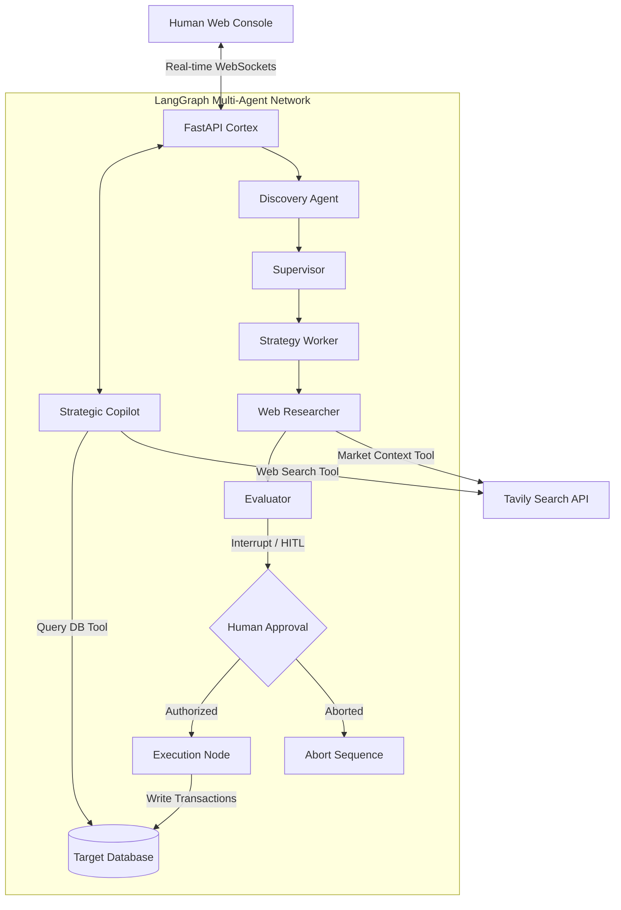

# 🧠 SageCommand OS // V2.0

[](https://nextjs.org/)
[](https://fastapi.tiangolo.com/)
[](https://langchain-ai.github.io/langgraph/)
[](https://ai.google.dev/)
[](https://tailwindcss.com/)

> **SageCommand** is a next-generation, LangGraph-orchestrated Omni-Agent COO and Command Center. It enables operational managers to hot-swap live database connections (PostgreSQL, MySQL, SQLite, CSV), run strategic analysis via a multi-agent backend, and execute supply-chain or industrial optimizations with **Human-in-the-Loop (HITL) guardrails**.

---

## 🚀 Key Capabilities

*   **⚡ Live DB Tethering & Hot-Swapping**: Instantly route Sage OS to any production cluster (PostgreSQL, MySQL, local SQLite) or compile raw CSV uploads into SQL databases on the fly without stopping the agent's execution.
*   **🤖 Multi-Agent Orchestration (LangGraph)**:
    *   **Strategic Copilot**: Direct conversational agent using tools (`list_database_tables`, `query_database`, and Tavily Web Search) to query databases and verify external context.
    *   **Discovery Agent**: Actively scans live inventory data for anomalies (e.g., stock depletion).
    *   **Supervisor**: Coordinates delegation and workflow execution.
    *   **Strategy Worker**: Synthesizes response actions (pricing, secondary suppliers).
    *   **Web Researcher**: Scans the internet for real-world global market context.
    *   **Evaluator**: Integrates internal data with external market trends to pick optimal paths.
*   **🛡️ Human-in-the-Loop Guardrail Intercept**: The system intercepts the agent pipeline before writing transactions. An evaluation card halts execution, allowing users to **Authorize** or **Abort** the agent's actions manually.
*   **🔮 Premium Obsidian Dashboard**: A responsive cyberpunk dark-mode command console built with React, Lucide Icons, and Framer Motion for smooth micro-animations and console telemetry logs.

---

## 🗺️ System Architecture



---

## 🛠️ Quick Start Guide

### Prerequisites
*   Node.js (v18+ recommended)
*   Python 3.10+
*   API keys for Google Gemini / Groq and Tavily Search

---

### 1. Backend Setup

1.  Navigate to the backend directory:
    ```bash
    cd backend
    ```
2.  Set up your python virtual environment and activate it:
    ```bash
    python -m venv venv
    # Windows:
    .\venv\Scripts\activate
    # macOS/Linux:
    source venv/bin/activate
    ```
3.  Install dependencies:
    ```bash
    pip install -r requirements.txt
    ```
4.  Configure environment variables. Copy `.env.example` to `.env` and fill in your API keys:
    ```bash
    cp .env.example .env
    ```
5.  Launch the FastAPI server:
    ```bash
    python server.py
    ```
    *The server runs locally at `http://127.0.0.1:8000`.*

---

### 2. Frontend Setup

1.  Navigate to the frontend directory:
    ```bash
    cd frontend
    ```
2.  Install packages:
    ```bash
    npm install
    ```
3.  Start the Next.js development server:
    ```bash
    npm run dev
    ```
    *The console is available at `http://localhost:3000`.*

---

## 🛡️ Heuristic Guardrails & HITL
When Sage OS performs a `Core Scan`, the **Evaluator Agent** determines the optimal operational action. Before the agent executes the action on the target database, LangGraph triggers an `interrupt_before`. 

```python
# Defined in agent_graph.py
sage_app = workflow.compile(checkpointer=memory, interrupt_before=["execution"])
```

The UI intercepts this event, halts execution, and displays the proposed action alongside a detailed reasoning breakdown:
1.  **Authorize**: Resumes the LangGraph thread to commit the transactions.
2.  **Abort**: Terminates the current loop safely without altering production state.

---

## 🎨 UI Styling & Design Systems
The UI utilizes a highly curated **Obsidian Cyberpunk** styling:
*   Curated dark palette (`#020202` deep background, neon cyan and purple accent tones).
*   Glassmorphism card effects using CSS borders (`border-white/5` and backdrop-filters).
*   Smooth telemetry feedback via real-time WebSocket connection state monitoring.
*   Compact, highly informative bento grid layouts matching premium SaaS control systems.

---

## 📄 License
Distributed under the MIT License. See `LICENSE` for more information.
