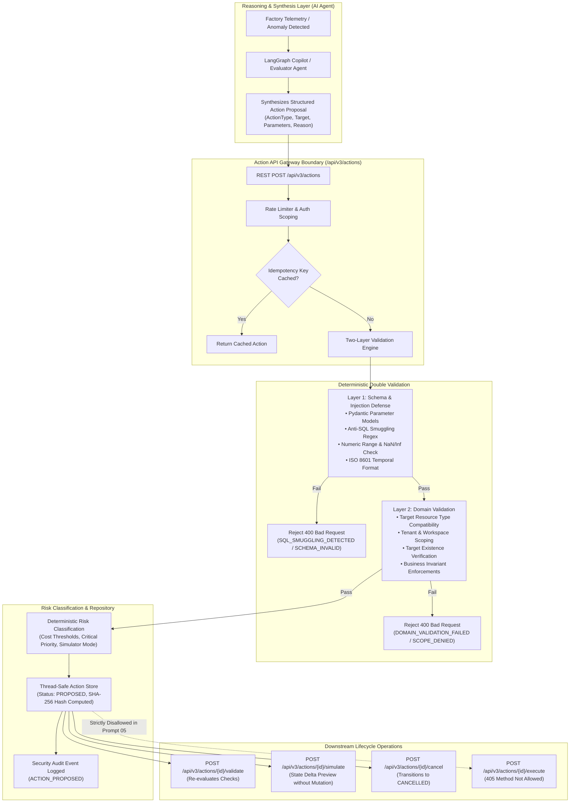

# SageCommand V3 — Structured Action API Architecture & Specification

## Overview

The **Structured Action API** forms the fundamental security and deterministic execution boundary of **SageCommand V3**.

### Core Architecture Principle:
> **"LLMs reason. Deterministic systems enforce."**
> **"Action creation is NOT action execution."**

In industrial operating environments, language models must NEVER generate or execute arbitrary operational commands or raw database write statements (`UPDATE`, `INSERT`, `DELETE`, `DROP`). The LLM synthesizes telemetry, predicts bottlenecks, and proposes a typed, versioned, and validated action. Deterministic systems validate schema safety, verify target compatibility, check tenant boundaries, compute risk levels, and present preview simulations.

---

## Architecture Flow

---

## 11 Supported Industrial Action Types

| Action Type | Description | Allowed Target Resources | Parameter Schema | Default Risk | Rollback Capability |
| :--- | :--- | :--- | :--- | :--- | :--- |
| `ADJUST_REORDER_POINT` | Adjusts safety stock reorder threshold for a warehouse SKU | `SKU`, `INVENTORY_ITEM`, `PRODUCT` | `new_reorder_point`, `sku_id`, `reason_code`, `effective_date` | `LOW` | `REVERSIBLE` |
| `REORDER_INVENTORY` | Dispatches replenishment purchase order to approved vendor | `SKU`, `INVENTORY_ITEM`, `SUPPLIER` | `quantity`, `sku_id`, `supplier_id`, `priority`, `required_by` | `MEDIUM` | `PARTIALLY_REVERSIBLE` |
| `MOVE_INVENTORY` | Transfers inventory stock between operational warehouses | `SKU`, `INVENTORY_ITEM`, `WAREHOUSE` | `quantity`, `from_warehouse`, `to_warehouse`, `sku_id` | `LOW` | `REVERSIBLE` |
| `SCHEDULE_MAINTENANCE` | Plans preventative downtime window for machinery | `MACHINE`, `PRODUCTION_LINE`, `SENSOR` | `machine_id`, `scheduled_start`, `estimated_duration_minutes`, `maintenance_type` | `MEDIUM` | `REVERSIBLE` |
| `CREATE_MAINTENANCE_WORK_ORDER` | Issues work order ticket to plant engineering crew | `MACHINE`, `PRODUCTION_LINE`, `MAINTENANCE_RECORD` | `machine_id`, `issue_description`, `title`, `severity`, `priority` | `LOW` | `REVERSIBLE` |
| `RESCHEDULE_PRODUCTION` | Reallocates factory shift hours or line throughput | `PRODUCTION_LINE`, `PLANT`, `PRODUCTION_PLAN` | `production_line`, `shift_hours`, `reason` | `HIGH` | `PARTIALLY_REVERSIBLE` |
| `CHANGE_PRODUCTION_PLAN` | Revises master manufacturing target outputs | `PRODUCTION_PLAN`, `PRODUCT`, `PRODUCTION_LINE` | `production_plan_id`, `target_units` | `CRITICAL` | `PARTIALLY_REVERSIBLE` |
| `UPDATE_SUPPLIER_ORDER` | Adjusts delivery windows for open vendor orders | `ORDER`, `SUPPLIER` | `order_id`, `new_delivery_date` | `MEDIUM` | `PARTIALLY_REVERSIBLE` |
| `ESCALATE_INCIDENT` | Elevates plant anomaly to corporate emergency response | `INCIDENT`, `PLANT` | `incident_id`, `escalation_level` | `LOW` | `IRREVERSIBLE` |
| `NOTIFY_STAKEHOLDER` | Broadcasts operational status bulletins | `CUSTOMER`, `PLANT`, `INCIDENT` | `recipient_role`, `message` | `LOW` | `IRREVERSIBLE` |
| `UPDATE_SLA_PRIORITY` | Modifies contractual response and service urgency | `SLA`, `CUSTOMER`, `ORDER` | `sla_id`, `new_priority` | `MEDIUM` | `REVERSIBLE` |

---

## Two-Layer Validation Engine

### Layer 1: Schema & Parameter Validation
1. **Pydantic Model Enforcement**: Strict typing for all parameters. Extra arbitrary injection payload fields are prohibited or safely sanitized.
2. **Anti-SQL Smuggling Defense**:
   - Recursive scan over keys and values.
   - Prohibited execution parameter keys: `sql`, `raw_sql`, `query`, `command`, `shell`, `script`, `javascript`, `python`, `cmd`, `exec`.
   - Detection of SQL statement patterns (`DROP TABLE`, `DELETE FROM`, `UPDATE ... SET`, `UNION SELECT`, `--`, `;`, `/*`).
3. **Numeric Safety**:
   - Verification against `NaN`, `+Infinity`, `-Infinity`.
   - Boundary checks (e.g. `quantity >= 1`, non-negative reorder points).
4. **Temporal Format Check**:
   - Strict ISO 8601 string parsing for all date and timestamp fields (`scheduled_start`, `required_by`, `new_delivery_date`, `effective_date`).

### Layer 2: Domain Validation
1. **Target Resource Compatibility**: Verifies that the specified target `resource_type` is permitted for the given `action_type`.
2. **Tenant and Workspace Scoping**: Verifies that the target resource belongs strictly to the authenticated tenant and workspace.
3. **Business Invariants**:
   - `MOVE_INVENTORY`: Source warehouse (`from_warehouse`) cannot equal target warehouse (`to_warehouse`).
   - `SCHEDULE_MAINTENANCE`: Duration must be greater than 0 minutes.
   - `REORDER_INVENTORY`: Quantity must be at least 1 unit.

---

## Authoritative Deterministic Risk Classification

To prevent LLM models from downplaying operational danger or bypassing safety policies, risk classification is computed **deterministically** by `ActionRegistry.classify_risk()`:

1. **Baseline Risk**: Derived from the canonical `ActionDefinition` default risk tier.
2. **Financial Threshold Escalation**:
   - Costs $\ge \$10,000$: Escalates `LOW`/`MEDIUM` to `HIGH`.
   - Costs $\ge \$50,000$: Escalates directly to `CRITICAL`.
3. **Critical Severity & Outage Escalation**:
   - Priority or Severity marked `CRITICAL` escalates to `HIGH` or `CRITICAL`.
   - Maintenance duration exceeding 8 hours (480 minutes) escalates to `HIGH`.
4. **Simulation Mode Guarantee**:
   - Actions with `data_mode="SIMULATION"` are bounded strictly to `LOW` risk.
5. **Approval Enforcement**:
   - Actions with `system_risk_level` in `[HIGH, CRITICAL]` enforce `requires_approval = True`.

---

## Safe Simulation Previews

The simulation engine (`ActionValidator.generate_simulation()`) computes expected before-and-after state deltas without executing any live database queries or altering equipment state:
- **Reorder Point**: Shows baseline threshold, proposed threshold, inventory threshold delta, and estimated holding cost impact.
- **Inventory Replenishment**: Shows allocation of pending inbound quantities and vendor lead-time estimates.
- **Maintenance Downtime**: Shows operational state transition (`RUNNING` $\rightarrow$ `PLANNED_MAINTENANCE`), capacity impact percentage, and risk reduction.

---

## Canonical REST API Endpoints (`/api/v3/actions`)

| Method | Path | Summary | Description |
| :--- | :--- | :--- | :--- |
| `POST` | `/api/v3/actions` | Propose Action | Validates, classifies risk, and registers a proposed action (201 Created). Supports `Idempotency-Key`. |
| `GET` | `/api/v3/actions` | List Actions | Queries tenant-scoped actions with filters (`action_type`, `status`, `risk_level`, `data_mode`) and pagination (`limit`, `offset`). |
| `GET` | `/api/v3/actions/{id}` | Get Action Detail | Retrieves action domain model with human-readable preview text. Enforces strict tenant isolation. |
| `POST` | `/api/v3/actions/{id}/validate` | Validate Action | Explicitly re-runs Layer 1 and Layer 2 validation checks. |
| `POST` | `/api/v3/actions/{id}/simulate` | Simulate Action | Generates deterministic before/after state delta preview without live mutation. |
| `POST` | `/api/v3/actions/{id}/cancel` | Cancel Action | Transitions an action in `PROPOSED` or `AWAITING_APPROVAL` status to `CANCELLED`. |
| `POST` | `/api/v3/actions/{id}/execute` | **DISALLOWED** | Returns `405 Method Not Allowed` (`EXECUTION_GATEWAY_NOT_IMPLEMENTED`). |

---

## Agent Tools Interface

Three LangGraph agent tools are exposed in `backend/tools/action_tools.py`:
1. `propose_action(...)`: Invoked by reasoning agents to propose typed actions without writing raw SQL.
2. `preview_action_impact(...)`: Invoked to simulate the projected consequence of an action before human review.
3. `list_supported_actions()`: Provides runtime introspection of supported action types, allowed target resources, and risk classifications.
