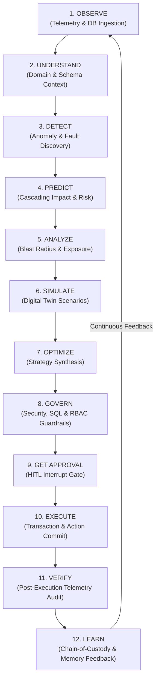

# 🧠 SageCommand V3 — Target System Architecture & Technical Specification

> **SageCommand V3**: An AI Operating System for Industrial Operations.

---

## 🗺️ 1. Target Architecture & System Topology

The target architecture decouples high-level reasoning from deterministic policy enforcement, providing an enterprise-grade AI operating system capable of continuous, autonomous operational oversight.

```text
                         ┌──────────────────────────┐
                         │       USER / COO         │
                         └────────────┬─────────────┘
                                      │
                                      ▼
                         ┌──────────────────────────┐
                         │   SAGE COMMAND CENTER    │
                         │   Copilot / Dashboard     │
                         └────────────┬─────────────┘
                                      │
                                      ▼
                         ┌──────────────────────────┐
                         │     MISSION MANAGER      │
                         └────────────┬─────────────┘
                                      │
                                      ▼
                    ┌────────────────────────────────────┐
                    │       AGENT ORCHESTRATION          │
                    │            LangGraph                │
                    └───────────────┬────────────────────┘
                                    │
             ┌──────────────────────┼──────────────────────┐
             ▼                      ▼                      ▼
      Intelligence             Decision                Knowledge
      ─────────────             ────────                ────────
      Anomaly                  Simulation               SOP/RAG
      Prediction               Optimization             Memory
      RCA                      Evaluation                Ontology
      Risk                     Scoring                   Graph
      Vision
             │                      │                      │
             └──────────────────────┼──────────────────────┘
                                    ▼
                         ┌──────────────────────────┐
                         │    POLICY ENGINE         │
                         │    SECURITY / RBAC       │
                         │    GOVERNANCE             │
                         └────────────┬─────────────┘
                                      │
                                      ▼
                         ┌──────────────────────────┐
                         │     ACTION GATEWAY       │
                         │ Structured Operations    │
                         └────────────┬─────────────┘
                                      │
                                      ▼
                         ┌──────────────────────────┐
                         │     HUMAN APPROVAL       │
                         │       when required      │
                         └────────────┬─────────────┘
                                      │
                                      ▼
                         ┌──────────────────────────┐
                         │       EXECUTION          │
                         └────────────┬─────────────┘
                                      │
                                      ▼
                         ┌──────────────────────────┐
                         │       VERIFICATION       │
                         └────────────┬─────────────┘
                                      │
                                      ▼
                         ┌──────────────────────────┐
                         │    LEARNING / MEMORY     │
                         └──────────────────────────┘
```

---

## 🔄 2. The 12-Stage Continuous Operational Loop

SageCommand V3 operates continuously along a closed-loop operational lifecycle:



---

## 🏛️ 3. Core Engineering Principle

> **"LLMs reason. Deterministic systems enforce."**

- **LLMs Reason**: Multi-agent nodes use Generative AI (Gemini 2.0 Flash / Llama 3.3 70B) to interpret unstructured multi-modal feeds, synthesize complex multi-objective resolution strategies, perform root-cause analysis, and project market volatility.
- **Deterministic Systems Enforce**: Hard coded Python policy engines, SQL guardrails (`validate_sql_query`), Role-Based Access Control (`is_high_risk_action`), cryptographic SHA-256 chain-of-custody logging, and transaction rollbacks strictly govern all state mutations.

---

## 📦 4. Domain Contracts & Schemas

The V3 architecture defines stable Pydantic domain contracts in [`backend/data/schemas/`](file:///c:/Users/Joyab/Downloads/SageCommand_Production/backend/data/schemas/):

### Core Entities
- **Plant**: Represents physical manufacturing facilities (`plant_id`, `name`, `location`, `lines`).
- **ProductionLine**: Represents assembly and processing lines (`line_id`, `name`, `machines`, `status`).
- **Machine**: Represents individual industrial machinery (`machine_id`, `category`, `status`, `sensors`).
- **Sensor**: Represents IoT telemetry transducers (`sensor_id`, `unit`, `current_value`, `status`).
- **Product / SKU**: Represents manufactured catalog items and stock keeping units (`sku_id`, `unit_price`).
- **InventoryItem**: Tracks warehouse stock levels and reorder boundaries (`quantity`, `reorder_threshold`).
- **Warehouse**: Storage facilities and capacity utilization metrics (`warehouse_id`, `capacity_used_pct`).
- **Supplier**: Component supply vendors and lead times (`supplier_id`, `lead_time_days`, `reliability_score`).
- **Customer**: Tier-1/Tier-2 enterprise customers and SLA commitments (`customer_id`, `sla_tier`).
- **Order**: Customer shipping and fulfillment requests (`order_id`, `status`).
- **Employee**: Facility operators, engineers, and managers (`employee_id`, `role`).
- **MaintenanceRecord**: Historical repair logs and part replacement records (`record_id`, `machine_id`).

---

## ⚡ 5. Standard Event & Action Contracts

### Common Event Model (`IndustrialEvent`)
```json
{
  "event_id": "8f3b2a1c-9941-42e1-b82d-10495f891a02",
  "event_type": "inventory.low_stock",
  "timestamp": "2026-09-14T11:00:00Z",
  "source": "discovery_agent",
  "tenant_id": "default_tenant",
  "plant_id": "PLANT-DETROIT-01",
  "severity": "HIGH",
  "entity_type": "inventory",
  "entity_id": "SKU-THERM-88",
  "payload": {
    "current_quantity": 4,
    "reorder_threshold": 30
  },
  "provenance": {
    "source": "dynamic_datacore.sqlite",
    "source_type": "REAL_DATA",
    "freshness_seconds": 1.2,
    "confidence": 1.0,
    "is_simulated": false
  }
}
```

### Common Action Model (`StructuredAction`)
```json
{
  "action_id": "7a91bf23-4011-47c3-a212-09418b776211",
  "action_type": "REORDER_INVENTORY",
  "target": {
    "entity_type": "SKU",
    "entity_id": "SKU-THERM-88"
  },
  "parameters": {
    "quantity": 500,
    "supplier_id": "SUP-APEX-01"
  },
  "reason": "Projected inventory depletion on Line Alpha within 4 hours",
  "risk_level": "MEDIUM",
  "estimated_cost": 3500.0,
  "requires_approval": true,
  "rollback_supported": true
}
```

---

## 🎯 6. Decision & Mission Models

### Mission Object (`MissionObject`)
High-level operational directive assigned by COO or Mission Manager:
- `mission_id`: Unique identifier
- `title`: e.g. *"Prevent Line 4 Shutdown"*
- `objective`: Operational goal statement
- `constraints`: `["Budget <= $10,000", "Zero customer SLA breaches"]`
- `allowed_actions`: `["Maintenance", "Inventory reallocation", "Expedited vendor shipping"]`
- `risk_tolerance`: `LOW`
- `success_criteria`: `["Line Alpha uptime > 99.5% for 24 hours"]`

### Decision Object (`DecisionObject`)
Complete context synthesis produced by Evaluator node before execution:
- `decision_id`, `incident_id`, `mission_id`
- `problem`, `objective`, `constraints`
- `evidence[]`, `strategies[]`, `selected_strategy`
- `confidence` (0.0-1.0), `uncertainty` (0.0-1.0)
- `risk`, `cost`, `financial_impact`
- `policy_result`, `approval_status`, `execution_status`, `verification_status`, `outcome`

---

## 🛡️ 7. Data Provenance & Lifecycle States

### Data Provenance Classifications
- `REAL_DATA`: Direct physical telemetry from PLC/ERP production sensors.
- `SIMULATED_DATA`: Synthetic data produced by Factory Simulator or Digital Twin.
- `STALE_DATA`: Cached telemetry exceeding freshness thresholds.
- `INFERRED_DATA`: Algorithmic calculations or model predictions.
- `AI_GENERATED_DATA`: Multi-agent synthesis outputs.

### System Lifecycle States
- **Incident Lifecycle**: `DETECTED` $\rightarrow$ `TRIAGED` $\rightarrow$ `ANALYZING` $\rightarrow$ `RECOMMENDATION_READY` $\rightarrow$ `AWAITING_APPROVAL` $\rightarrow$ `APPROVED` / `REJECTED` $\rightarrow$ `EXECUTING` $\rightarrow$ `VERIFYING` $\rightarrow$ `RESOLVED` / `FAILED` / `ROLLED_BACK`.
- **Action Lifecycle**: `PROPOSED` $\rightarrow$ `POLICY_REVIEW` $\rightarrow$ `AWAITING_APPROVAL` $\rightarrow$ `APPROVED` $\rightarrow$ `EXECUTING` $\rightarrow$ `SUCCEEDED` / `FAILED` / `ROLLED_BACK`.
