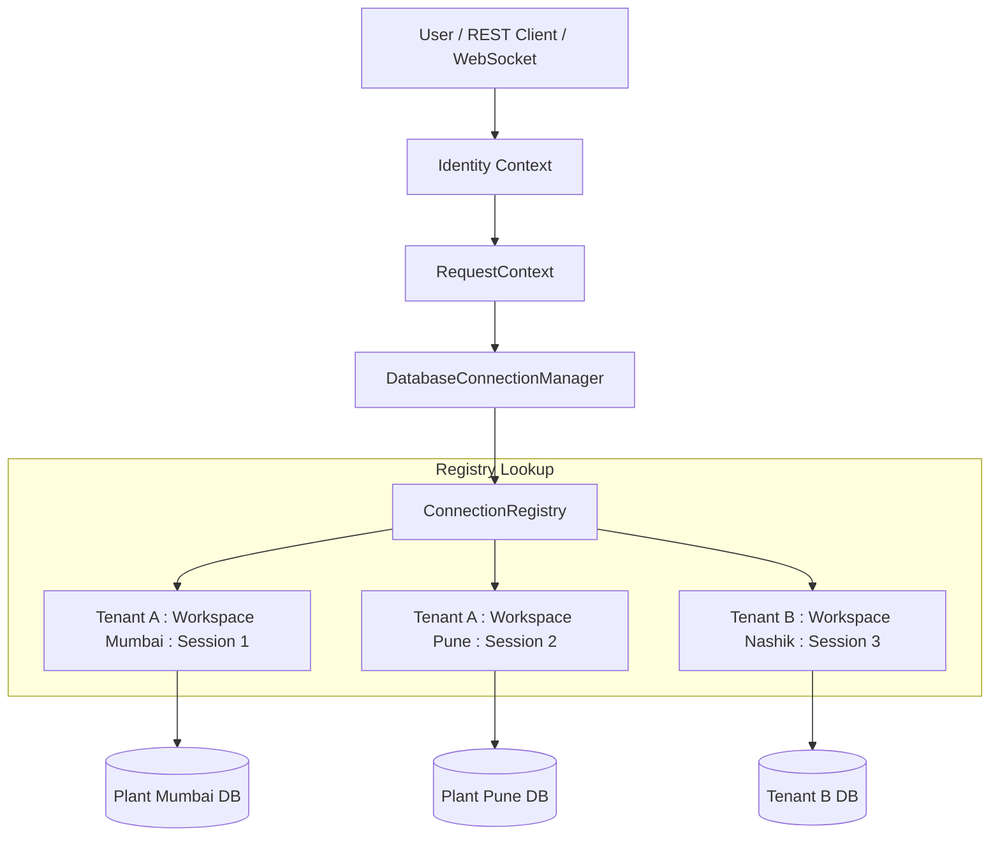

# SageCommand V3 — Session-Scoped Database Architecture

## 1. Executive Summary & Core Principle

In SageCommand V3, database execution contexts are strictly isolated per caller session to prevent cross-tenant, cross-workspace (plant), or cross-session database data leakage:

> **"No agent, LLM, API route, background task, or WebSocket handler may directly depend on a process-wide mutable database connection."**

All database interactions resolve dynamically through `DatabaseConnectionManager` using caller identity context.

---

## 2. Hierarchical Architecture



### Hierarchy Breakdown
- **Tenant (`tenant_id`)**: Multi-tenant organization boundary.
- **Workspace (`workspace_id`)**: Operational plant boundary (e.g. Mumbai Plant, Pune Plant).
- **Session (`session_id`)**: User or agent execution session.
- **Database Context (`DatabaseContext`)**: Session-bound metadata container storing `connection_id`, `access_mode`, `data_mode`, `status`, `database_type`, and `safe_representation`.
- **Connection Manager (`DatabaseConnectionManager`)**: Server-side manager controlling SQLAlchemy engine creation, connection acquisition, health checks, access mode checks, and lifecycle cleanup.
- **Database Engine (`Engine`)**: Isolated SQLAlchemy engine instance tied to the scoped context.

---

## 3. Database Access Modes & Provenance

### 3.1 Access Modes (`AccessMode`)
- `READ_ONLY`: Default mode for analytical AI operations (inventory checks, RCA, reporting). Writes strictly forbidden.
- `READ_WRITE`: Authorized transaction execution mode.
- `ADMIN`: High-clearance administrative operations.
- `SIMULATION`: Isolated simulation mode.

### 3.2 Data Modes (`DataMode`)
- `REAL`: Live production factory telemetry and inventory data.
- `SIMULATION`: Isolated synthetic simulation data.
- `HYBRID`: Mixed real and simulated data mode.

> **Simulation Protection Rule**: Any write request attempting to execute against a `REAL` database using `SIMULATION` mode is automatically rejected with a `PermissionError`.

---

## 4. LangGraph Checkpoint Safety

LangGraph `SageOSState` dictionary stores ONLY safe string identifiers:
- `tenant_id`
- `workspace_id`
- `session_id`
- `connection_id`
- `access_mode`
- `data_mode`

**Raw SQLAlchemy engines, database connection handles, or plain-text credentials are NEVER serialized into checkpoint state.** When a tool or agent node executes, it resolves the connection dynamically via `db_manager.get_connection(tenant_id, workspace_id, session_id, connection_id)`.

---

## 5. Lifecycle & Health Monitoring

```text
REQUESTED -> VALIDATING -> CONNECTING -> CONNECTED -> HEALTHY / UNHEALTHY -> DISCONNECTED
```

- **Health Checks**: `db_manager.health_check(...)` executes a lightweight ping query (`SELECT 1`) to measure latency and verify connectivity.
- **Disconnection**: `db_manager.disconnect(...)` disposes the SQLAlchemy engine pool and removes the context from `ConnectionRegistry`.
