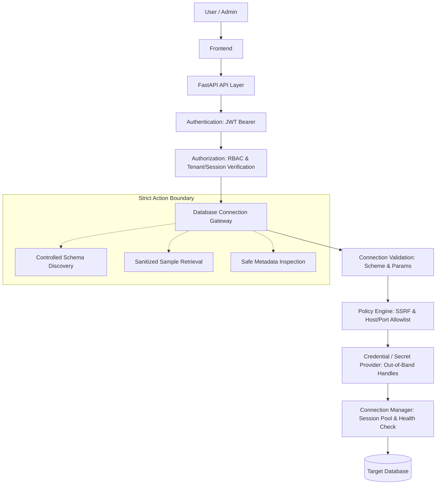

# SageCommand V3 — Secure Database Connection Gateway

**Date:** 2026-09-14  
**Version:** SageCommand V3.0  
**Phase:** Prompt 04 — Secure Database Connection Gateway  

---

## 1. Executive Summary & Purpose

The **Secure Database Connection Gateway** (`DatabaseConnectionGateway`) serves as the mandatory security perimeter between SageCommand and all external database infrastructure. 

Prior to Prompt 04, external database connections risked direct exposure to user-supplied connection strings, potential Server-Side Request Forgery (SSRF), credential leakage in logs or state checkpoints, unmitigated plain-text connections, and untrusted execution surfaces.

Under the V3 Gateway architecture:
- **Zero Direct Connection Creation:** Agents, LLMs, and external clients NEVER directly instantiate SQLAlchemy engines, connect to raw sockets, or receive raw database credentials.
- **Fail-Closed Security by Default:** All outbound connections must satisfy stringent network policies, host and port allowlists, and SSL/TLS verification rules. In production mode, empty allowlists reject all outbound traffic.
- **Out-of-Band Secrets:** Raw credentials are exchanged for opaque secret references (`sec_...`) managed strictly within `SecretProvider`.
- **Safe Schema & Data Masking:** Schema discovery and sampling are bounded, sanitized, and automatically redact sensitive fields (passwords, tokens, keys).
- **Strict Action Boundary:** The gateway is limited to connectivity validation, health checks, metadata extraction, and safe sampling. Arbitrary SQL execution is strictly forbidden.

---

## 2. Gateway Architecture & Workflow

The end-to-end connection flow proceeds through verified security layers:



---

## 3. Network Policy Engine & SSRF Protection

The network policy engine (`backend/gateway/network_policy.py`) inspects all destination endpoints before any network socket is opened.

### 3.1 Network Policy Modes (`SAGE_DB_NETWORK_POLICY`)
- **`RESTRICTED` (Default in Production):** Rejects all private IP ranges, loopback addresses, link-local addresses, and cloud provider metadata endpoints. Outbound destinations must explicitly match `SAGE_DB_ALLOWED_HOSTS`.
- **`ALLOWLIST`:** Allows only destinations specifically listed in `SAGE_DB_ALLOWED_HOSTS` or falling within specified CIDR blocks.
- **`INTERNAL_ONLY`:** Permits intranet and internal RFC1918 subnets, but strictly blocks public IPs and cloud metadata services.
- **`PRIVATE_ALLOWED`:** Permits local and intranet connections for development and testing environments.

### 3.2 Target Host and CIDR Allowlisting
- Host allowlist is configured via `SAGE_DB_ALLOWED_HOSTS` (comma-separated).
- Supports exact hostnames (`db.internal.corp`), exact IP addresses (`10.0.0.15`), and CIDR network blocks (`10.20.30.0/24`, `192.168.1.0/24`).
- In production (`ENVIRONMENT=production` or `IS_PRODUCTION=True`), an empty allowlist fails closed.

### 3.3 SSRF Hardening
The gateway unconditionally blocks attempts to reach:
- **Cloud Metadata Services:** `169.254.169.254`, `metadata.google.internal`, `instance-data`.
- **Loopback Networks:** `127.0.0.0/8`, `::1`, `0.0.0.0`.
- **Unsupported & Malicious Schemes:** Any scheme outside approved database adapters (e.g., `file://`, `http://`, `ftp://`, `gopher://`) is rejected immediately with `DATABASE_UNSUPPORTED`.

---

## 4. Database Adapter Architecture

SageCommand V3 adopts a modular database adapter pattern (`backend/gateway/db_adapters.py`) adhering to the `DatabaseAdapter` abstract interface:

```python
class DatabaseAdapter(ABC):
    @abstractmethod
    def connect(self, context: DatabaseContext) -> Any: ...
    @abstractmethod
    def validate_uri(self, uri: str) -> bool: ...
    @abstractmethod
    def health_check(self, context: DatabaseContext) -> HealthCheckResult: ...
    @abstractmethod
    def get_schema(self, context: DatabaseContext, limit_tables: int) -> Dict[str, Any]: ...
    @abstractmethod
    def get_metadata(self, context: DatabaseContext) -> Dict[str, Any]: ...
    @abstractmethod
    def close(self, context: DatabaseContext) -> None: ...
```

### Supported Adapters
1. **`PostgreSQLAdapter`** (`postgresql://`, `postgresql+psycopg2://`):
   - Enforces TLS parameters (`sslmode=require`, `verify-ca`, `verify-full`).
   - Default port: `5432`.
2. **`MySQLAdapter`** (`mysql://`, `mysql+pymysql://`):
   - Enforces TLS parameters (`ssl_mode=REQUIRED`, `ssl={"ssl_mode": "REQUIRED"}`).
   - Default port: `3306`.
3. **`SQLServerAdapter`** (`mssql://`, `mssql+pyodbc://`):
   - Enforces TLS parameters (`Encrypt=yes`, `TrustServerCertificate=no`).
   - Default port: `1433`.
4. **`SQLiteAdapter`** (`sqlite://`):
   - Restricted to local file validation, path traversal prevention, and memory/temporary stores.
   - Non-network adapter (exempt from port allowlisting).

---

## 5. Out-of-Band Credential Security

To guarantee that credentials cannot be harvested via prompt injection or log extraction:
- **`SecretProvider` Abstraction:** Secrets (passwords, certificates) are ingested out-of-band and referenced via opaque secret IDs (`sec_...`).
- **Zero-Exposure State:** Only sanitized URIs with credentials scrubbed (`user:***@host:port/db`) are stored in `DatabaseContext` and `SageOSState`.
- **LLM / Agent Isolation:** Agents querying the gateway receive only structural metadata (table names, column types, descriptions) with zero infrastructure credentials or connection strings.
- **Encryption at Rest:** `EnvSecretProvider` supports transparent symmetric Fernet encryption when `SAGE_DB_ENCRYPTION_KEY` is configured.

---

## 6. Lifecycle Management & Session Isolation

Database connections are isolated across the multi-tenant hierarchy:
`Tenant -> Workspace -> Session -> ConnectionContext`

- **Ownership Verification:** Every gateway request validates that the caller's `tenant_id` and `session_id` match the connection context. Cross-tenant or cross-session access triggers an immediate `DATABASE_POLICY_BLOCKED` audit event.
- **Idle Timeout (`SAGE_DB_IDLE_TIMEOUT`):** Connections inactive for more than 1,800 seconds (configurable) are automatically closed and evicted.
- **Max Lifetime (`SAGE_DB_MAX_LIFETIME`):** Hard limit of 86,400 seconds (configurable), after which connections must be refreshed.
- **Explicit Revocation:** `DELETE /api/v3/db/connections/{connection_id}` disposes underlying SQLAlchemy pools and terminates active handles.

---

## 7. Safe Schema Discovery & Sensitive Data Masking

The gateway provides bounded, sanitized inspection utilities:
- **Bounded Discovery:** Limits table discovery to `limit_tables` (default 50) and column inspection to `limit_columns` (default 100).
- **Sensitive Column Masking:** Any column name containing sensitive keywords (`password`, `secret`, `token`, `api_key`, `ssn`, `credential`, `hash`, `cvv`) has its sample values automatically masked as `[REDACTED]`.
- **Read-Only Sampling:** Sample data retrieval is restricted to `SELECT` queries with strict row limits (maximum 10 rows).

---

## 8. Normalized Error Taxonomy

The gateway maps raw driver errors to standardized error codes:

| Gateway Error Code | HTTP Status | Description |
| :--- | :---: | :--- |
| `DATABASE_POLICY_BLOCKED` | `403` | Denied by SSRF protection, host/port allowlist, or tenant isolation |
| `DATABASE_UNSUPPORTED` | `400` | Unsupported URI scheme or malformed connection string |
| `DATABASE_TLS_FAILED` | `400` | SSL/TLS policy violated (e.g. unencrypted in production) |
| `DATABASE_AUTH_FAILED` | `401` | Authentication failure against target database |
| `DATABASE_HOST_UNREACHABLE` | `502` | DNS failure or target host TCP connection refused |
| `DATABASE_TIMEOUT` | `504` | Connection timeout during TCP handshake or health check |
| `DATABASE_NOT_FOUND` | `404` | Specified connection identifier does not exist |

---

## 9. REST API Specification

| Endpoint | Method | Role Required | Description |
| :--- | :---: | :---: | :--- |
| `/api/v3/db/validate` | `POST` | `operator`, `manager` | Pre-validates URI scheme, network policy, and SSL mode without opening sockets |
| `/api/v3/db/connect` | `POST` | `operator`, `manager` | Authenticates, validates, registers connection, and executes initial health check |
| `/api/v3/db/schema/{connection_id}` | `GET` | `operator`, `manager` | Retrieves sanitized schema (tables, columns, primary keys) |
| `/api/v3/db/metadata/{connection_id}` | `GET` | `operator`, `manager` | Retrieves high-level connection metadata and health status |
| `/api/v3/db/sample` | `POST` | `operator`, `manager` | Retrieves up to 10 sample rows with sensitive column masking |
| `/api/v3/db/connections/{connection_id}` | `DELETE` | `operator`, `manager` | Revokes connection, closes socket pools, and purges credentials |
| `/api/connect-live-db` | `POST` | `operator`, `manager` | Legacy V2/V3 compatibility endpoint routed through `db_gateway` |
