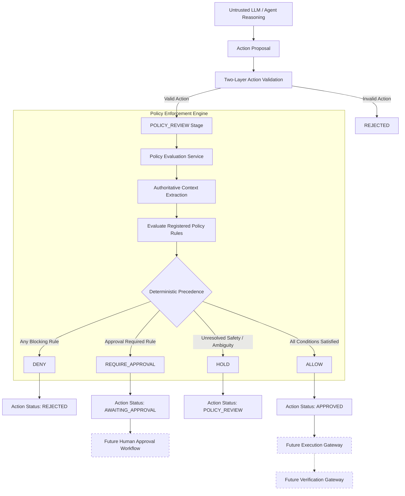

# SageCommand V3 — Deterministic Policy Enforcement Engine Architecture

## 1. Executive Summary

The **Deterministic Policy Enforcement Engine** is the authoritative governance boundary of SageCommand V3. It operates strictly between **Structured Action Validation** (Prompt 05) and downstream human-in-the-loop approval / future execution gateways.

The governing principle of the system is:
> **LLMs reason. Actions represent intent. Policy enforces governance. Future execution performs effects.**

The Policy Engine evaluates already-structured Actions against deterministic system policies and produces an immutable, explainable, and cryptographically fingerprinted `PolicyDecision`. It does **not** execute actions, mutate physical machinery, or alter production databases.



---

## 2. Policy Effects & Deterministic Precedence

The Policy Engine supports four mutually exclusive deterministic effects:

| Effect | Description | Action Transition |
| :--- | :--- | :--- |
| **`DENY`** | The action violates a mandatory policy constraint. Cannot proceed without policy revision or action restructuring. | `REJECTED` |
| **`REQUIRE_APPROVAL`** | The action is safe under policy constraints but mandates authorized human-in-the-loop governance sign-off before proceeding. | `AWAITING_APPROVAL` |
| **`HOLD`** | System cannot determine safety due to missing context, unclassified risk, or ambiguity. **Fails closed**. | Retained in `POLICY_REVIEW` |
| **`ALLOW`** | All operational constraints satisfied; no additional approval required under active policy set. **Does not execute action**. | `APPROVED` |

### Precedence Hierarchy
When multiple policy rules fire across an evaluation session, effects are resolved using strict deterministic precedence:
$$\text{DENY} \succ \text{REQUIRE\_APPROVAL} \succ \text{HOLD} \succ \text{ALLOW}$$

1. **Any applicable `DENY`** $\rightarrow$ Final decision is **`DENY`**. If an `ALLOW` rule also fired, a `POLICY_CONFLICT` reason code is appended to the decision trace.
2. **Else any applicable `REQUIRE_APPROVAL`** $\rightarrow$ Final decision is **`REQUIRE_APPROVAL`**, populated with the corresponding `ApprovalRequirement`.
3. **Else any unresolved safety-critical condition** $\rightarrow$ Final decision is **`HOLD`**.
4. **Else applicable `ALLOW`** $\rightarrow$ Final decision is **`ALLOW`**.
5. **Default-Deny Fallback**: If zero active policies match the action's scope and type, the system fails closed with `HOLD` (`NO_MATCHING_POLICY_FOUND`).

---

## 3. Supported Condition Categories & Operators

### Supported Attribute Categories
Attributes are strictly extracted from server-authoritative context and validated Actions. Client-supplied parameters cannot spoof identity, risk, or approvals.

- `ACTION_TYPE`: Canonical action type (e.g. `CHANGE_PRODUCTION_PLAN`, `ADJUST_REORDER_POINT`).
- `ACTION_VERSION`: Semantic schema version.
- `RISK_LEVEL`: Authoritative deterministic system risk (`LOW`, `MEDIUM`, `HIGH`, `CRITICAL`).
- `RESOURCE_TYPE`: Target industrial resource class (`PLANT`, `PRODUCTION_LINE`, `MACHINE`, `SKU`, etc.).
- `RESOURCE_ID`: Target resource identifier string.
- `PLANT`: Plant identifier scope.
- `WORKSPACE`: Partition workspace identifier.
- `TENANT`: Authoritative tenant isolation ID.
- `DATA_MODE`: Operating data mode (`REAL`, `SIMULATION`, `HYBRID`).
- `ACCESS_MODE`: Read/write access scope (`READ_ONLY`, `READ_WRITE`).
- `USER_SCOPE`: Requesting user identifier.
- `MISSION`: Associated mission ID.
- `INCIDENT`: Active anomaly incident ID (e.g. `PLANT_SHUTDOWN`).
- `ESTIMATED_COST`: Numeric USD impact.
- `ESTIMATED_DURATION`: Estimated duration in minutes.
- `TIME_WINDOW`: Server-authoritative time evaluation (e.g. `"09:00-18:00"`).
- `DAY_OF_WEEK`: Server day of the week (e.g. `"MONDAY"`).
- `APPROVAL_REQUIRED`: System approval requirement flag.
- `ROLLBACK_SUPPORT`: Capability (`REVERSIBLE`, `PARTIALLY_REVERSIBLE`, `IRREVERSIBLE`).
- `CAPABILITY`: Resource capabilities array.

### Deterministic Operators (Zero `eval()` / `exec()`)
- `EQUALS` / `NOT_EQUALS`: Case-insensitive strict equality.
- `IN` / `NOT_IN`: Membership testing within collections.
- `GREATER_THAN` / `GREATER_THAN_OR_EQUAL` / `LESS_THAN` / `LESS_THAN_OR_EQUAL`: Safe numeric comparisons (rejection of `NaN` / `Infinity`).
- `CONTAINS` / `NOT_CONTAINS`: Substring or collection containment.
- `MATCHES_SCOPE`: Scope hierarchy matching against tenant, plant, and workspace.
- `WITHIN_TIME_WINDOW`: Operational window range check against server time.
- `EXISTS` / `NOT_EXISTS`: Nullability checks.

---

## 4. Built-in Canonical Industrial Policies

SageCommand V3 bootstraps 7 core operational policies persisted in SQLite (`policies_v3`):

1. **`POL-DEFAULT-SHUTDOWN-DENY`** (Priority 100): Strictly freezes and denies all operational mutations during scheduled plant shutdowns or `PLANT_SHUTDOWN` incidents.
2. **`POL-CRITICAL-LINE-APPROVAL`** (Priority 85): Enforces Manager approval for throughput rescheduling or production plan revisions on critical lines.
3. **`POL-HIGH-COST-APPROVAL`** (Priority 80): Tiered financial governance:
   - Impact $\ge \$10,000$ and $< \$50,000$ mandates Operations Manager clearance.
   - Impact $\ge \$50,000$ mandates Executive Committee sign-off.
4. **`POL-RISK-LEVEL-APPROVAL`** (Priority 75): Mandates human supervisor authorization for any action classified with deterministic `HIGH` or `CRITICAL` risk.
5. **`POL-SIMULATION-ALLOW`** (Priority 70): Permits autonomous experimentation when running in `SIMULATION` data mode with `LOW` risk.
6. **`POL-LOW-RISK-REORDER-ALLOW`** (Priority 60): Permits routine low-risk inventory safety stock adjustments and internal moves under $\$5,000$ without requiring human approval.
7. **`POL-SUPPLIER-UPDATE-APPROVAL`** (Priority 65): Requires procurement manager clearance before updating external purchase orders or vendor agreements.

---

## 5. Canonical Policy REST API Contracts

Base Prefix: `/api/v3/policies`

### 1. `POST /api/v3/policies/evaluate`
Evaluates an existing, validated action against active system policies.

**Request**:
```json
{
  "action_id": "act_3f92b71c08",
  "policy_ids": null
}
```

**Response (200 OK)**:
```json
{
  "success": true,
  "request_id": "req_84f1a20b",
  "decision": {
    "decision_id": "dec_c91a04f281",
    "action_id": "act_3f92b71c08",
    "decision": "REQUIRE_APPROVAL",
    "policy_id": "POL-CRITICAL-LINE-APPROVAL",
    "policy_version": "1.0",
    "tenant_id": "tenant_default",
    "reason_codes": ["POLICY_APPROVAL_REQUIRED"],
    "explanation": "Human authorization required by policy 'POL-CRITICAL-LINE-APPROVAL': Production modifications affecting critical manufacturing lines require manager clearance.",
    "risk_level": "MEDIUM",
    "requires_approval": true,
    "approval_requirement": {
      "required": true,
      "approval_type": "MANAGER",
      "required_role": "manager",
      "minimum_approvers": 1,
      "reason_code": "POLICY_APPROVAL_REQUIRED",
      "reason": "Production modifications affecting critical manufacturing lines require manager clearance.",
      "policy_id": "POL-CRITICAL-LINE-APPROVAL",
      "policy_version": "1.0"
    },
    "evaluated_at": "2026-09-14T12:30:00Z",
    "decision_hash": "e3b0c44298fc1c149afbf4c8996fb92427ae41e4649b934ca495991b7852b855"
  }
}
```

### 2. `POST /api/v3/policies/simulate`
Dry-run simulation of policy evaluation with zero side effects or status mutations.

### 3. Policy Management Endpoints (Manager Role Required)
- `GET /api/v3/policies`: List active/all policies for caller's tenant.
- `GET /api/v3/policies/{id}`: Retrieve current policy details.
- `GET /api/v3/policies/{id}/versions/{version}`: Retrieve specific historical version.
- `POST /api/v3/policies`: Register new versioned policy definition.
- `POST /api/v3/policies/{id}/activate`: Activate policy version.
- `POST /api/v3/policies/{id}/disable`: Disable policy version.
