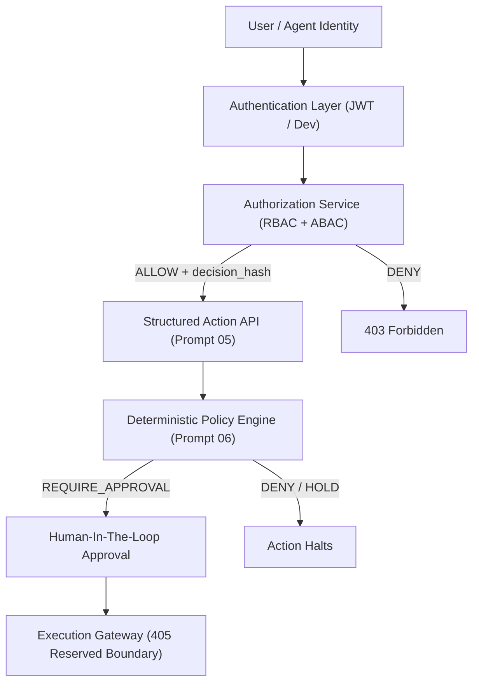
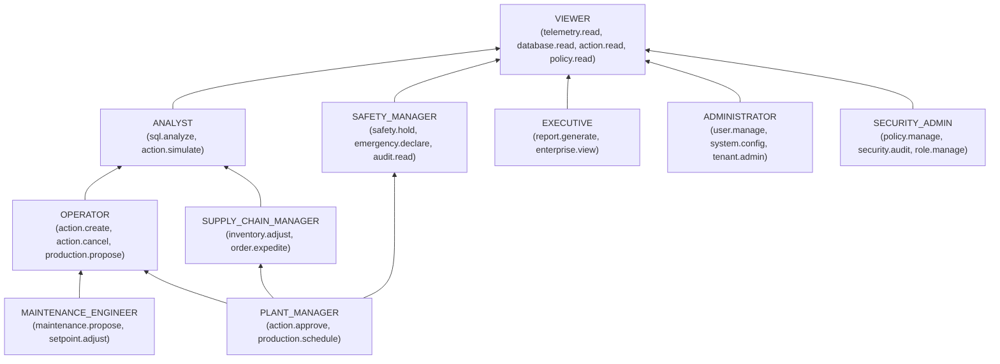

# SageCommand V3 — RBAC + ABAC Authorization Architecture

## 1. Architectural Philosophy & Invariants

SageCommand V3 enforces a deterministic, fail-closed authorization layer separating user capabilities and resource boundaries from AI reasoning and real-world execution.

The cardinal security invariants are:

```text
Authentication != Authorization != Policy != Approval != Execution
```

1. **Authentication** establishes *who* the caller is (`Identity` / `UserIdentity`).
2. **Authorization** evaluates *what* capabilities the identity possesses and *where* they may exercise them (RBAC + ABAC).
3. **Policy Enforcement** evaluates *whether* an authorized action is operationally safe according to dynamic factory rules (Prompt 06 Policy Engine).
4. **Approval** governs human verification for high-risk actions (HITL Workflow).
5. **Execution** performs operational mutations on physical machines or databases (strictly reserved for future Execution Gateways; `POST /api/v3/actions/{id}/execute` returns `405 Method Not Allowed`).



---

## 2. Canonical Permissions Catalog

All capabilities in SageCommand V3 are discrete, namespaced tokens following the `resource.action` syntax.

| Permission ID | Resource | Action | Sensitivity | Description |
| :--- | :--- | :--- | :--- | :--- |
| `telemetry.read` | `telemetry` | `read` | Standard | Stream live and historical sensor/line telemetry |
| `machine.status.read` | `machine` | `status.read` | Standard | Read equipment operating state and alarms |
| `database.read` | `database` | `read` | Standard | Execute read-only SQL queries and inspect schema |
| `sql.analyze` | `sql` | `analyze` | Standard | Analyze SQL syntax and generate execution profiles |
| `database.connection.create` | `database` | `connection.create` | **Sensitive** | Register new database connection target |
| `database.connection.admin` | `database` | `connection.admin` | **Sensitive** | Administer connection pool, credentials, and network rules |
| `action.create` | `action` | `create` | Standard | Propose structured operational actions |
| `action.read` | `action` | `read` | Standard | Inspect action lifecycle status, parameters, and audits |
| `action.simulate` | `action` | `simulate` | Standard | Request deterministic before/after simulation preview |
| `action.cancel` | `action` | `cancel` | Standard | Cancel pending action proposal |
| `action.approve` | `action` | `approve` | **Sensitive** | Approve high-risk operational proposals |
| `production.propose` | `production` | `propose` | Standard | Propose changes to production schedule or line rates |
| `production.schedule` | `production` | `schedule` | **Sensitive** | Approve or modify factory production schedules |
| `maintenance.propose` | `maintenance` | `propose` | Standard | Propose machine lockout or preventative maintenance |
| `setpoint.adjust` | `setpoint` | `adjust` | **Sensitive** | Request machine operational setpoint change |
| `inventory.adjust` | `inventory` | `adjust` | Standard | Propose component or inventory count modification |
| `order.expedite` | `order` | `expedite` | Standard | Request order expediting or priority override |
| `safety.hold` | `safety` | `hold` | **Sensitive** | Declare safety hold on manufacturing lines |
| `emergency.declare` | `emergency` | `declare` | **Sensitive** | Trigger emergency condition or safe shutdown |
| `policy.read` | `policy` | `read` | Standard | View deterministic safety policy rules |
| `policy.manage` | `policy` | `manage` | **Sensitive** | Create, update, or archive policy rules |
| `audit.read` | `audit` | `read` | **Sensitive** | Inspect security and governance audit logs |
| `security.audit` | `security` | `audit` | **Sensitive** | Perform security compliance analysis and verification |
| `report.generate` | `report` | `generate` | Standard | Generate executive operational and compliance reports |
| `enterprise.view` | `enterprise` | `view` | Standard | Enterprise cross-tenant and cross-plant visibility |
| `user.manage` | `user` | `manage` | **Sensitive** | Create, update, or suspend user identities |
| `system.config` | `system` | `config` | **Sensitive** | Platform infrastructure and endpoint configuration |
| `tenant.admin` | `tenant` | `admin` | **Sensitive** | Tenant partition and quota administration |
| `role.assign` | `role` | `assign` | **Sensitive** | Assign roles to identities |
| `role.manage` | `role` | `manage` | **Sensitive** | Define or modify role permission templates |

---

## 3. Canonical System Roles & Acyclic Inheritance

SageCommand V3 defines 10 canonical roles. Inheritance is evaluated transitively as a Directed Acyclic Graph (DAG). Any circular reference is detected via DFS cycle detection and rejected fail-closed.



### Privileged Operation Protection (Administrative Boundary)
System administrators (`ADMINISTRATOR`) and security officers (`SECURITY_ADMIN`) strictly do **NOT** possess operational authority. They cannot create, approve, or adjust production actions without holding a dedicated operational role (`OPERATOR`, `PLANT_MANAGER`).

---

## 4. Attribute-Based Access Control (ABAC) Rules

The `AuthorizationService` enforces deterministic ABAC attribute constraints:

1. **Tenant Isolation**:
   - `identity.tenant_id == scope.tenant_id`.
   - Cross-tenant requests immediately fail with `TENANT_MISMATCH`.
2. **Workspace Isolation**:
   - If `scope.workspace_id` is specified, `identity.workspace_id == scope.workspace_id` (or `*`).
   - Mismatches fail with `WORKSPACE_MISMATCH`.
3. **Hierarchical Plant Scoping**:
   - If `scope.plant_id` is specified, `identity.assigned_plants` must contain `"*"` or the exact `scope.plant_id`.
   - Unassigned plant targets fail with `PLANT_SCOPE_DENIED`.
4. **Separation of Duties (Dual-Control Invariant)**:
   - For `action.approve` or `production.schedule`, the system verifies:
     ```python
     if context.proposer_id and context.proposer_id == identity.user_id:
         return DENY(SEPARATION_OF_DUTIES_VIOLATION)
     ```
   - An operator or manager can never approve their own proposed action.
5. **Security Clearance Levels**:
   - Every identity has `clearance_level` (1=Standard, 2=Elevated, 3=Confidential, 4=Secret, 5=Top Secret).
   - High-security operations enforce `identity.clearance_level >= context.required_clearance`.
6. **Data Mode Restrictions**:
   - In `HISTORICAL` mode, mutating operations (`action.create`, `setpoint.adjust`, etc.) are blocked with `DATA_MODE_RESTRICTED`.
7. **User Lifecycle Status**:
   - Accounts in `SUSPENDED`, `REVOKED`, or `PENDING` states are blocked with `IDENTITY_NOT_ACTIVE`.

---

## 5. Cryptographic Decision Fingerprint

Every `AuthorizationDecision` computes an SHA-256 tamper-evident checksum:

```python
payload = {
    "decision_id": d_id,
    "effect": effect.value,
    "reason_code": reason_code.value,
    "required_permission": required_permission.lower().strip(),
    "matched_role": matched_role or "",
    "evaluated_at": evaluated_at
}
decision_hash = hashlib.sha256(json.dumps(payload, sort_keys=True).encode("utf-8")).hexdigest()
```

This cryptographic fingerprint guarantees tamper resistance across asynchronous queues, audit logs, and compliance records.

---

## 6. REST API Contract

Base prefix: `/api/v3/authorization`

### 1. `POST /api/v3/authorization/check`
Evaluates a structured capability check against a target scope.

**Request:**
```json
{
  "required_permission": "action.create",
  "target_scope": {
    "tenant_id": "tenant_default",
    "plant_id": "plant_01"
  },
  "data_mode": "LIVE"
}
```

**Response (200 OK):**
```json
{
  "success": true,
  "request_id": "req_a1b2c3d4",
  "decision": {
    "decision_id": "authz_91b645c45936",
    "effect": "ALLOW",
    "reason_code": "ALLOWED",
    "reason": "Access granted for capability 'action.create' via role 'OPERATOR'.",
    "required_permission": "action.create",
    "matched_role": "OPERATOR",
    "resolved_permissions": [
      "action.cancel",
      "action.create",
      "action.read",
      "action.simulate",
      "database.read",
      "machine.status.read",
      "policy.read",
      "production.propose",
      "sql.analyze",
      "telemetry.read"
    ],
    "evaluated_at": "2026-09-14T14:17:42Z",
    "decision_hash": "1ece4c982e87c0c64af00922f25f9b38714aa94e2564f2843131768cb69763af"
  }
}
```

### 2. `GET /api/v3/authorization/permissions`
Returns the authoritative system permissions catalog with descriptions and sensitivity tags.

### 3. `GET /api/v3/authorization/roles`
Returns all registered system and custom roles.

### 4. `GET /api/v3/authorization/roles/{role_id}`
Returns the definition of a specific role alongside its transitively resolved effective permissions.
