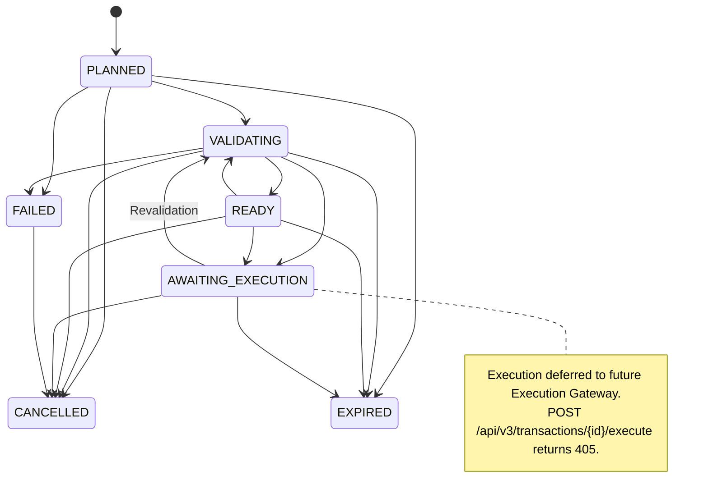

# SAGECOMMAND V3 — TRANSACTION & ROLLBACK ARCHITECTURE

## 1. Executive Summary & Architectural Role

The **Transaction & Rollback Architecture** (Prompt 09) establishes the definitive, deterministic boundary between governance approvals and real-world execution in SageCommand V3. It transforms high-level industrial intents—previously validated, authorized, and policy-approved—into concrete, structured, and auditable operational plans **without performing real-world execution**.

### Cardinal Architectural Invariant

$$\text{Authentication} \neq \text{Authorization} \neq \text{Policy} \neq \text{Approval} \neq \text{Transaction Plan} \neq \text{Execution} \neq \text{Verification} \neq \text{Rollback} \neq \text{Audit}$$

```text
PROPOSED ACTION
      ↓
ACTION VALIDATION (Prompt 05)
      ↓
RBAC + ABAC AUTHORIZATION (Prompt 07)
      ↓
DETERMINISTIC POLICY ENGINE (Prompt 06)
      ↓
HUMAN-IN-THE-LOOP APPROVAL (Prompt 05 / V2)
      ↓
═══════════════════════════════════════════════════════════════
  TRANSACTION & ROLLBACK ARCHITECTURE (Prompt 09)
  • Synthesizes TransactionPlan (Deterministic Preconditions & Invariants)
  • Analyzes Rollback Capability (DATABASE_ROLLBACK, COMPENSATING_ACTION, MANUAL_RECOVERY)
  • Enforces Idempotency & Revalidation against drift
  • side_effects = False, execution_permitted = False
═══════════════════════════════════════════════════════════════
      ↓ (Execution Boundary — Strictly Guarded 405)
EXECUTION GATEWAY (Future Prompt 10)
      ↓
REAL-WORLD ATOMIC COMMIT / COMPENSATION
```

---

## 2. Core Domain Models

The architecture models transactions and compensation via canonical Pydantic schemas in `backend/data/schemas/transaction_contract.py`:

### 2.1 Transaction Model (`Transaction`)
- `transaction_id`: `tx_{uuid}` canonical identifier.
- `transaction_version`: Semantic schema version.
- `tenant_id`, `workspace_id`, `session_id`, `plant_id`: Strict isolation boundary hierarchy.
- `action_id`, `action_version`: Governed action provenance.
- `status`: Lifecycle state managed by `TransactionStateMachine`.
- `transaction_type`: `DATABASE`, `PHYSICAL_PLANT`, `HYBRID`, `SIMULATION`.
- `data_mode`: `REAL`, `SIMULATION`, `HYBRID`.
- `access_mode`: `READ_WRITE`, `READ_ONLY`.
- `plan`: Authoritative `TransactionPlan` specification.
- `idempotency_key`: Client-supplied unique token preventing duplicate executions.
- `rollback_supported`: `SUPPORTED`, `PARTIALLY_SUPPORTED`, `NOT_SUPPORTED`, `UNKNOWN`.
- `revalidation_count`, `last_revalidated_at`: Concurrency and drift tracking.

### 2.2 TransactionPlan Specification (`TransactionPlan`)
- `preconditions`: List of `TransactionPrecondition` records that must evaluate to `True` immediately prior to execution (e.g. optimistic concurrency state version matching, inventory non-negative check, machine online status).
- `invariants`: List of `TransactionInvariant` rules (e.g. `quantity >= 0`, `estimated_cost >= 0`) that must never be violated during or after transaction execution.
- `affected_resources`: Explicit declaration of industrial resources affected by the transaction (machines, lines, SKUs, warehouses) bounded by `plant_id`.
- `rollback_plan`: `RollbackPlan` detailing compensation sequence, preconditions, limitations, and strategy.
- `transaction_plan_hash`: SHA-256 integrity fingerprint computed across canonical JSON serialization of plan fields.
- `side_effects`: Fixed to `False` in Prompt 09.
- `execution_permitted`: Fixed to `False` in Prompt 09.

---

## 3. Transaction Lifecycle State Machine

Transitions are guarded by `TransactionStateMachine` in `backend/services/transaction_service.py`:



---

## 4. Rollback Strategies & Capability Classification

Industrial actions cannot always be rolled back using relational database ACID mechanisms. SageCommand classifies every action into a deterministic rollback strategy:

| Strategy | Capability | Applicability | Example |
| :--- | :--- | :--- | :--- |
| `DATABASE_ROLLBACK` | `SUPPORTED` | Relational database writes, SQL mutations, table schema updates | Reverting a table insert or update within a database transaction |
| `COMPENSATING_ACTION` | `SUPPORTED` / `PARTIALLY_SUPPORTED` | Discrete physical operations that have an inverse operational step | Inventory transfer (`WH-ALPHA -> WH-BETA`) compensated by reverse transfer (`WH-BETA -> WH-ALPHA`) |
| `MANUAL_RECOVERY` | `PARTIALLY_SUPPORTED` | High-risk physical equipment modifications requiring human technician intervention | Machine recalibration or tool replacement |
| `NOT_SUPPORTED` | `NOT_SUPPORTED` | Irreversible industrial events | Machine emergency power kill, consumable dispensing, physical welding |

---

## 5. Concurrency, Idempotency & Drift Detection

### 5.1 Idempotency Key Semantics
When planning a transaction with an `idempotency_key`:
1. If an existing transaction with the same `(tenant_id, idempotency_key)` exists and its `action_id` and parameters match, the existing transaction record is returned (`200 OK` or `201 Created`).
2. If an existing transaction exists with the same key but differing `action_id` or target, an `IDEMPOTENCY_CONFLICT` is raised (`409 Conflict`), preventing parameter contamination.

### 5.2 Multi-Phase Drift Revalidation
Prior to any future execution, `POST /api/v3/transactions/{id}/revalidate` verifies:
- **Action Drift**: Ensures the underlying `Action` hash has not changed.
- **Policy Drift**: Detects whether security or operational policies have been modified since the plan was formed.
- **Authorization Drift**: Re-evaluates whether the initiating user still possesses the requisite permissions.
- **Temporal Drift / Expiration**: Validates that `now < expires_at` (default TTL: 3600 seconds).
- **Resource Version Drift**: Checks optimistic concurrency versions against live resource state.

---

## 6. Execution Boundary Enforcement (HTTP 405)

To maintain absolute safety, Prompt 09 strictly prohibits autonomous or manual execution:

```python
@router.post("/{transaction_id}/execute")
def execute_transaction_boundary(transaction_id: str):
    raise HTTPException(
        status_code=status.HTTP_405_METHOD_NOT_ALLOWED,
        detail="Transaction execution is disabled in Prompt 09. Execution requires the future Execution Gateway."
    )

@router.post("/{transaction_id}/rollback")
def rollback_transaction_boundary(transaction_id: str):
    raise HTTPException(
        status_code=status.HTTP_405_METHOD_NOT_ALLOWED,
        detail="Transaction rollback execution is disabled in Prompt 09. Rollback requires the future Execution Gateway."
    )
```

---

## 7. Audit Ledger Integration

Every transaction event emits an append-only, tamper-evident audit entry into the Prompt 08 Audit Ledger (`AuditLedgerService`):
- `TRANSACTION_PLANNED`
- `TRANSACTION_VALIDATION_STARTED`
- `TRANSACTION_VALIDATED` / `TRANSACTION_INVALID`
- `TRANSACTION_CONFLICT_DETECTED`
- `TRANSACTION_CANCELLED`
- `TRANSACTION_EXPIRED`
- `ROLLBACK_PLAN_CREATED`
- `ROLLBACK_CAPABILITY_CHECKED`

All records include tenant context, actor identities, resource scope, and SHA-256 integrity hashes.
