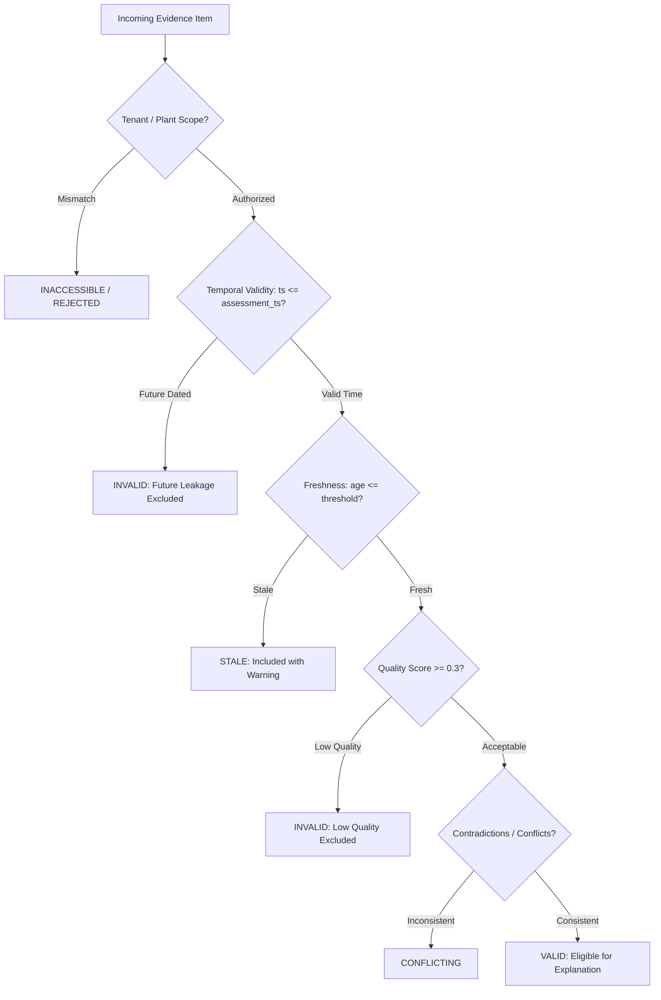

# SageCommand V3 — Evidence and Explainability Intelligence Foundation (Prompt 31)

## 1. Mission and Architecture

The **Evidence and Explainability Intelligence Foundation** provides a deterministic, tenant-isolated analytical layer for tracing analytical conclusions and decision recommendations back to their underlying evidence.

SageCommand V3 integrates analytical intelligence across data quality, anomalies, events, incidents, root-cause analysis, blast-radius assessment, predictive maintenance, demand forecasting, supplier risk, SLA/customer risk, financial impact, sustainability, sensor fusion, what-if counterfactual simulation, optimization, and decision evaluation.

Prompt 31 establishes a unified, reproducible foundation to identify, link, inspect, validate, and explain evidence across all these analytical subsystems.

### Core Architectural Answers:
1. **What evidence supports this conclusion?** Specific, linked `EvidenceRecord` items with quality scores, provenance, and timestamps.
2. **Which subsystem produced the evidence?** Explicit, versioned `EvidenceSourceType` registry (Decision Engine, Optimization, What-If Simulation, Sensor Fusion, etc.).
3. **Which source records and assessments contributed?** Verifiable foreign keys (`source_record_id`) into upstream analytical subsystems.
4. **When was the evidence observed, received, or assessed?** Explicit ISO 8601 timestamps evaluated relative to a fixed evaluation timestamp.
5. **Was it observed, derived, forecast, simulated, estimated, or unknown?** Strict provenance tracking (`EvidenceProvenance` enum).
6. **Which assumptions and transformations contributed?** Declarative `EvidenceTransformation` specifications.
7. **Which criteria and constraints affected a decision?** Criterion-level contributions, binding constraints, and policy evaluations.
8. **Which evidence was rejected, stale, missing, conflicting, or insufficient?** Explicit `EvidenceRejection`, `EvidenceConflict`, and `EvidenceGap` tracking.
9. **What limitations remain?** Governed `ExplanationLimitation` specifications with severity codes and mitigations.
10. **Can the same inputs and algorithm version reproduce the same explanation?** 100% deterministic, canonical serialization with SHA-256 fingerprints.

---

## 2. Cardinal Invariants and Execution Boundary

> [!IMPORTANT]
> **ANALYTICAL EXPLAINABILITY AND EVIDENCE TRACING ONLY.**
> An explanation describes the evidence and reasoning behind an outcome.
> It does **NOT** authorize an action, change a decision policy, or execute a recommendation.
>
> The Evidence and Explainability layer is a **read-only analytical integration layer**.
> It **never** mutates underlying operational or source subsystem records.
>
> **Notice:** `EXPLAINABILITY ANALYSIS ONLY — NOT AUTHORIZED AND NOT EXECUTED`

### Non-Goals and Explicit Execution Boundaries:
- Never executes physical commands, writes to PLCs/controllers, or actuates valves/switches.
- Never dispatches work orders, issues purchase orders, or adjusts inventory counts.
- Never modifies upstream analytical results, optimization solutions, or Decision Engine rankings.
- Never accepts arbitrary executable Python code, raw SQL, or unverified instructions as evidence transformations.
- Never bypasses RBAC/ABAC authorization or cross-tenant isolation boundaries.

---

## 3. Typed Contract Hierarchy

All contracts are defined using Pydantic V2 with strict type validation, finite number constraints, non-empty identifiers, and ISO-8601 timezone-aware timestamps.

### 3.1 Provenance Classifications (`EvidenceProvenance`)
- `OBSERVED`: Ground-truth physical facts, raw sensor telemetry, event bus emissions, and database state.
- `DERIVED`: Deterministic mathematical aggregations, normalized scores, fusions, or calculations.
- `FORECAST`: Predictive machine learning outputs, future-horizon demand projections, RUL estimates.
- `SIMULATED`: Counterfactual What-If simulation outputs under hypothetical parameters.
- `ESTIMATED`: Approximate bounds, statistical estimations, or heuristic metrics.
- `UNKNOWN`: Unclassified or missing provenance metadata.

> [!WARNING]
> Provenance is preserved across multi-hop derivations. A simulation run based on an observed baseline remains classified as `SIMULATED`, with its parent observed baseline retained in the lineage graph. Simulations and forecasts are **never** relabeled as observed facts.

### 3.2 Supported Evidence Sources (`EvidenceSourceType`)
- `DECISION_ENGINE` (Prompt 30)
- `OPTIMIZATION` (Prompt 29)
- `WHAT_IF_SIMULATION` (Prompt 28)
- `SENSOR_FUSION` (Prompt 27)
- `SUSTAINABILITY` (Prompt 26)
- `FINANCIAL_IMPACT` (Prompt 25)
- `SLA_CUSTOMER_RISK` (Prompt 24)
- `SUPPLIER_RISK` (Prompt 23)
- `DEMAND_FORECASTING` (Prompt 22)
- `PREDICTIVE_MAINTENANCE` (Prompt 21)
- `BLAST_RADIUS` (Prompt 20)
- `ROOT_CAUSE_ANALYSIS` (Prompt 19)
- `INCIDENT_MANAGEMENT` (Prompt 18)
- `EVENT_BUS` (Prompt 17)
- `ANOMALY_DETECTION` (Prompt 15)
- `DATA_QUALITY` (Prompt 14)
- `DIGITAL_TWIN` (Prompt 13)
- `OPERATIONAL_KNOWLEDGE_GRAPH` (Prompt 12)
- `INDUSTRIAL_ONTOLOGY` (Prompt 11)
- `MANUAL_OPERATOR`
- `EXTERNAL_SYSTEM`

### 3.3 Core Contract Models
- `EvidenceRecord`: Canonical representation of an analytical observation, assessment, or derivation with quality scores, provenance, and payload.
- `EvidenceReference`: Lightweight link connecting an evidence item to a decision criterion, alternative, or analytical target.
- `EvidenceLineageEdge`: Directed parent-to-child lineage relationship with edge types (`DERIVED_FROM`, `SIMULATED_FROM`, `AGGREGATED_FROM`, `CORRELATED_WITH`, `CONTRADICTS`, `SUPPORTS`).
- `EvidenceLineageGraph`: Bounded, deterministic directed graph of evidence lineage with cycle detection and depth tracking.
- `EvidenceTransformation`: Declarative transformation description (input keys, output keys, algorithm version, parameters).
- `EvidenceFreshnessAssessment`: Age computation in seconds relative to the fixed assessment timestamp against configured thresholds.
- `EvidenceValidationResult`: Itemized validation result with status (`VALID`, `STALE`, `MISSING`, `INVALID`, `CONFLICTING`, `INACCESSIBLE`).
- `EvidenceRejection`: Structured exclusion record explaining why evidence was disqualified.
- `EvidenceConflict`: Explicit record of contradictory observations or incompatible semantics.
- `EvidenceGap`: Explicit record of missing parents, unavailable records, or insufficient evidence coverage.
- `EvidenceContribution`: Quantified criterion-level scoring contribution for decision alternatives.
- `ExplanationNode` & `ExplanationEdge`: Human-facing explanation graph connecting recommendations, options, criteria, constraints, and evidence.
- `ExplanationResult`: Complete governed analytical explanation payload.
- `EvidenceAuditRecord`: Immutable ledger entry with cryptographic checksum.

---

## 4. Evidence Validation Pipeline

The deterministic validation pipeline evaluates evidence against 12 formal criteria:



### Key Principles:
- **No Future Leakage**: Any evidence dated after the fixed assessment timestamp is excluded from historical explanations and recorded in `rejections`.
- **No Silent Dropping**: Excluded evidence is preserved in `excluded_evidence` along with a structured `EvidenceRejection` reason code.
- **Differentiated Ineligibility**: Clearly distinguishes between a record that does not exist (`MISSING`), exists in another tenant (`INACCESSIBLE`), or fails data quality (`INVALID`).

---

## 5. Decision Engine Integration (Prompt 30)

When explaining a Decision Engine evaluation (`POST /api/v3/evidence-explainability/explain` with `target_type="DECISION_ENGINE"`):

1. **Retrieves Evaluation**: Loads `DecisionEvaluation` by `decision_id` with tenant isolation.
2. **Preserves Scores**: Retains original composite scores, rankings, recommendation status, and constraint evaluations.
3. **Maps Contributions**: Calculates criterion-level contributions for each alternative:
   $$\text{Contribution} = \text{Normalized Score} \times \text{Criterion Weight}$$
4. **Traces Recommendation**: Shows why the recommended option was preferred:
   - Hard constraints satisfied vs violated by runner-ups.
   - Governance policies verified as compliant.
   - Highest composite weighted score.
5. **Connects Evidence Snapshot**: Converts `DecisionEvidenceReference` items into `EvidenceRecord` nodes, validates freshness and temporal consistency, and links them directly to the relevant criteria and alternatives.
6. **Constructs Explanation Graph**: Visualizes:
   $$\text{Decision Outcome} \longleftarrow \text{Candidate Alternatives} \longleftarrow \text{Criteria \& Constraints} \longleftarrow \text{Supporting Evidence}$$

---

## 6. Determinism and Fingerprinting

Lineage graphs, validation outcomes, and explanations are **100% deterministic** for identical canonical inputs:

```python
def compute_explanation_fingerprint(
    tenant_id, workspace_id, plant_id,
    target_type, target_id,
    assessment_timestamp, algorithm_version, contract_version,
    supporting_evidence_ids, excluded_evidence_ids,
    rejection_reasons, gaps, limitations,
    recommendation_summary
) -> str
```

- Canonical JSON serialization with sorted keys (`sort_keys=True`) and sorted identifier arrays.
- Memory addresses, random UUIDs, and dict insertion order are excluded.
- Material alterations to timestamps, source records, or limitations produce distinct SHA-256 hashes.

---

## 7. Persistence and Security

- **Database**: SQLite WAL mode via `backend/repositories/evidence_explainability_repository.py`.
- **Concurrency**: Thread-safe with `threading.Lock()` guards.
- **Tenant Isolation**: Every SQL query strictly binds `tenant_id = ?`. Cross-tenant queries return non-disclosing 404s.
- **Bounded Queries**: Query limits capped at 200 items to prevent resource exhaustion.
- **Foreign Keys**: Enabled (`PRAGMA foreign_keys = ON`).

### Permissions:
- `evidence_explainability.read`: View explanations, lineage graphs, and evidence records (`VIEWER`, `ANALYST`, `OPERATOR`, `ADMINISTRATOR`).
- `evidence_explainability.explain`: Generate deterministic explanations and lineage graphs (`ANALYST`, `OPERATOR`, `ADMINISTRATOR`).
- `evidence_explainability.validate`: Run batch evidence validations (`ANALYST`, `OPERATOR`, `ADMINISTRATOR`).
- `evidence_explainability.admin`: Administrative authority over thresholds and limits (`ADMINISTRATOR`).

---

## 8. REST API Endpoints

Root prefix: `/api/v3/evidence-explainability`

| Method | Endpoint | Description | Permission |
|--------|----------|-------------|------------|
| `POST` | `/explain` | Generate deterministic evidence explanation | `evidence_explainability.explain` |
| `POST` | `/validate` | Validate batch of evidence records | `evidence_explainability.validate` |
| `GET` | `/{explanation_id}` | Retrieve explanation by ID | `evidence_explainability.read` |
| `GET` | `/{explanation_id}/lineage` | Retrieve lineage graph | `evidence_explainability.read` |
| `GET` | `/{explanation_id}/evidence` | Retrieve supporting and excluded evidence | `evidence_explainability.read` |
| `GET` | `/{explanation_id}/audit` | Retrieve immutable audit history | `evidence_explainability.read` |
| `GET` | `` | List historical explanations (paginated) | `evidence_explainability.read` |

---

## 9. Verification Commands

Run the dedicated test suite:
```bash
python -m pytest backend/test_v3_evidence_explainability.py -q -ra
```

Run full V3 regression suite:
```bash
python -m pytest backend/ -k "test_v3_" -q -ra
```

Build the frontend bundle:
```bash
cd frontend && npm run build
```
