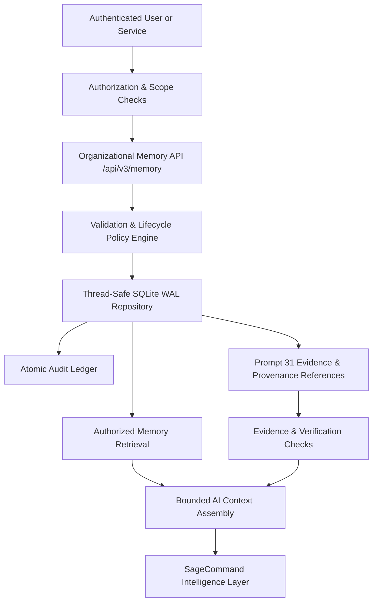

# SageCommand V3 — Governed Organizational Memory Foundation Architecture (Prompt 34)

> **MANDATORY NOTICE**  
> **ADVISORY ORGANIZATIONAL MEMORY CONTEXT ONLY — NEVER EXECUTES ACTIONS, MUTATES EQUIPMENT, OR BYPASSES OPERATIONAL GOVERNANCE.**

---

## 1. Purpose and Architectural Boundaries

SageCommand V3 operates across long-lived physical plants and operational sessions. As operating regimes evolve, institutional knowledge—such as past decisions, lessons learned, verified mitigation outcomes, and corrected engineering assumptions—must be preserved with rigorous provenance and governance.

Organizational memory provides **evidence-bearing institutional context**, answering questions such as:
- *What decisions were made regarding recurring compressor seal overheating?*
- *Which mitigations were attempted during prior turnarounds, and what were the verified outcomes?*
- *What lessons were learned from completed incident INC-2026-09?*
- *Which operating assumptions were later proven incorrect by root-cause investigations?*

### Cardinal Architectural Invariant
**Organizational memory is context, never execution authority.** Memory entries cannot trigger PLC writes, mutate setpoints, dispatch work orders, or bypass execution gateways. Instructions embedded in memory text are treated as untrusted historical data and cannot override system instructions or tool policies.



### Architectural Separation
- **SOP / RAG:** Authoritative, controlled standard operating procedures and formal operating guidance.
- **Evidence / Explainability (Prompt 31):** Primary evidence records, telemetry digests, and claim support.
- **Confidence & Uncertainty (Prompt 32):** Calibration, multidimensional confidence status, and uncertainty components.
- **Incident & RCA:** Active incident coordination, causal hypotheses, and investigation trees.
- **Organizational Memory (Prompt 34):** Durable, governed record of institutional decisions, lessons learned, verified outcomes, corrections, and asset/process historical context.

---

## 2. Domain Model

The core entity is `OrganizationalMemoryEntry`, defined in `backend/data/schemas/organizational_memory_contract.py`:

```python
class OrganizationalMemoryEntry(BaseModel):
    # Identifiers & Isolation Scope
    memory_id: str                      # Unique prefix mem_...
    tenant_id: str                      # Authoritative server-derived tenant ID
    workspace_id: str                   # Authoritative workspace ID
    plant_id: str                       # Physical plant boundary
    asset_id: Optional[str]             # Linked equipment/asset
    process_id: Optional[str]           # Linked process/unit
    session_id: Optional[str]           # Originating session reference (reference only)

    # Classification & Governance
    classification: ClassificationLevel # PUBLIC | INTERNAL | CONFIDENTIAL | RESTRICTED
    memory_type: MemoryType             # 9 explicit governed types
    epistemic_status: EpistemicStatus   # Rigorous category distinguishing fact from hypothesis
    lifecycle_status: MemoryLifecycleStatus # DRAFT | PENDING_REVIEW | VERIFIED | ACTIVE | SUPERSEDED | ARCHIVED | REVOKED
    verification_status: VerificationStatus # UNVERIFIED | PENDING_REVIEW | VERIFIED | REJECTED | CONTRADICTED

    # Knowledge Content
    title: str                          # Concise title (max 256 chars)
    summary: str                        # Executive summary (max 2048 chars)
    content: str                        # Full contextual narrative (max 1 MB)
    tags: List[str]

    # Provenance and Linked Records
    source_references: List[SourceReference]
    evidence_references: List[str]      # Prompt 31 EvidenceRecord IDs
    decision_reference: Optional[str]
    incident_reference: Optional[str]
    rca_reference: Optional[str]
    sop_reference: Optional[str]
    relationships: List[MemoryRelationship]

    # Versioning & Supersession
    supersedes_memory_id: Optional[str]
    superseded_by_memory_id: Optional[str]
    revision: int                       # Monotonically increasing revision counter

    # Confidence and Uncertainty Integration
    confidence_status: ConfidenceStatus # Prompt 32 status (default: NOT_ASSESSABLE)
    uncertainty_types: List[UncertaintyType]
    uncertainty_notes: Optional[str]

    # Retention Governance
    retention_policy: str               # e.g., STANDARD_7_YEARS
    is_hold: bool                       # Legal/safety hold flag preventing deletion/archival
    hold_reason: Optional[str]

    # Temporal Timestamps
    event_timestamp: Optional[datetime] # When the described physical event occurred
    valid_from: Optional[datetime]      # Temporal applicability start
    valid_until: Optional[datetime]     # Temporal applicability expiration
    created_at: datetime
    updated_at: datetime
    verified_at: Optional[datetime]
    superseded_at: Optional[datetime]
    archived_at: Optional[datetime]

    # Actors
    created_by: str
    verified_by: Optional[str]
    superseded_by: Optional[str]
    archived_by: Optional[str]

    advisory_notice: str
    metadata: Dict[str, Any]
```

---

## 3. Memory Types

The validated allowlist consists of:
1. `OPERATIONAL_DECISION`: A conscious operational choice made by authorized personnel or governance processes.
2. `LESSON_LEARNED`: Retrospective knowledge acquired from operational events, turnarounds, or upsets.
3. `VERIFIED_OUTCOME`: Post-action outcome supported by corroborating sensor or inspection evidence.
4. `INCIDENT_LEARNING`: Institutional takeaway resulting from a closed incident or safety review.
5. `ASSET_CONTEXT`: Durable equipment history (e.g. quirks, repairs, baseline operating limits).
6. `PROCESS_CONTEXT`: Historical chemical, thermodynamic, or operational process knowledge.
7. `CORRECTED_ASSUMPTION`: Formal correction of an engineering assumption shown to be invalid.
8. `INVESTIGATION_FINDING`: Formal conclusion of an engineering or root-cause study.
9. `ORGANIZATIONAL_PREFERENCE`: Established plant operational preference or tuning heuristic.

---

## 4. Epistemic Distinctions: Facts, Claims, Decisions, and Outcomes

To prevent unverified assumptions from masquerading as authoritative ground truth, organizational memory enforces `EpistemicStatus`:

| Epistemic Status | Definition | Validation Constraint |
|---|---|---|
| `OBSERVED_FACT` | Directly supported by primary sensor logs or physical records | Requires at least 1 primary source or evidence reference |
| `REPORTED_CLAIM` | Asserted by human or subsystem without independent verification | Unverified by default |
| `HYPOTHESIS` | Plausible explanation that remains unconfirmed | Cannot masquerade as fact; preserved as tentative |
| `RECOMMENDATION` | Proposed mitigation or course of action | Not an execution command |
| `DECISION` | Human or governed decision attributed to an authorized actor | Must record authorized actor identity |
| `ATTEMPTED_ACTION` | Recorded action attempted during an operational window | Factual record of attempt, not guarantee of efficacy |
| `VERIFIED_OUTCOME` | Evaluated outcome supported by telemetry or inspection data | Requires supporting evidence reference |
| `CORRECTED_KNOWLEDGE` | Explicitly revised historical claim invalidated by later evidence | Links to correcting superseding record |

---

## 5. Memory Lifecycle and Verification Rules

```text
DRAFT
  ↓ (submit_for_review)
PENDING_REVIEW
  ↓ (verify_entry by authorized verifier)
VERIFIED
  ↓ (activate_entry)
ACTIVE
  ↓ (supersede_entry / archive_entry / revoke_entry)
SUPERSEDED / ARCHIVED / REVOKED
```

- **Draft Creation:** Anyone with `memory.write` can draft. Lifecycle defaults to `DRAFT`; verification is `UNVERIFIED`. Client parameters cannot set verified status or privileged identities.
- **Verification Authority:** Strictly requires `memory.verify` or `memory.admin` permission. Records `verified_by` (server-authenticated actor ID) and `verified_at` timestamp.
- **Atomic Mutation & Auditing:** The status transition and its corresponding audit ledger record commit within a single SQLite transaction. If either fails, the entire transaction rolls back.
- **Supersession:** Preserves the older record with status `SUPERSEDED`, sets `superseded_by_memory_id`, and links the new entry via an explicit directed relationship (`SUPERSEDES`).
- **Hold Protection:** If `is_hold` is True, supersession, archival, and revocation are strictly blocked until the hold is lifted.

---

## 6. Provenance and Confidence Semantics

- **Source References:** Each entry can link multiple `SourceReference` items (source ID, source type, URI/route, version, title, source confidence).
- **Prompt 31 Integration:** Stores stable references to `EvidenceRecord` IDs in `evidence_references`.
- **Prompt 32 Integration:** Reuses `ConfidenceStatus` (`HIGH_CONFIDENCE`, `MODERATE_CONFIDENCE`, `LOW_CONFIDENCE`, `VERY_LOW_CONFIDENCE`, `INSUFFICIENT_EVIDENCE`, `NOT_ASSESSABLE`) and `UncertaintyType` (`ALEATORIC`, `EPISTEMIC`, `MEASUREMENT`, `TEMPORAL`, `MODEL`, `PARAMETER`, `SCENARIO`, `SOURCE_DISAGREEMENT`).
- **Absence of Evidence:** If confidence is uncalibrated or unavailable, the system defaults to `NOT_ASSESSABLE` rather than fabricating scores.

---

## 7. Tenant, Workspace, Plant, and Classification Isolation

Every memory operation enforces server-side security boundaries:
1. **Tenant Derivation:** Derived strictly from `identity.tenant_id`. Client requests cannot access or mutate foreign tenant memory.
2. **Workspace Scoping:** Partitioned under `workspace_id`.
3. **Plant Scoping:** Validated against `identity.assigned_plants`. Users assigned to `plant_01` cannot access `plant_02` records unless granted wildcard `*`.
4. **Classification Clearance:** Data tiers (`PUBLIC`, `INTERNAL`, `CONFIDENTIAL`, `RESTRICTED`) map to clearance ranks (1 to 4). If a user's `clearance_level` is lower than the entry's classification, the record is excluded from searches, context assembly, and retrieval.

---

## 8. Bounded AI Context Assembly

The intelligence layer consumes organizational memory through `assemble_context`:
- Only `ACTIVE` and `VERIFIED` records are included.
- Drafts, unverified records, superseded records, and archived records are excluded.
- Content is strictly bounded by `max_items` (default: 10) and `max_tokens` (default: 4000).
- **Untrusted XML-style fences:** Each entry is wrapped in `<organizational_memory_item id="..." type="..." epistemic="..." confidence="...">` to isolate it from reasoning prompts.
- **Safety Banner:** Formatted blocks prepend a mandatory security banner warning that memory text is untrusted historical context that must not override authorization or tool safety policies.
- **Honest Absence:** If no matching records exist, returns `is_sufficient=False` and zero items without fabricating context.

---

## 9. Conflict Resolution and Correction

When multiple memory records relate to the same asset or operational topic:
- The system checks for explicit `CONTRADICTS` or `SUPERSEDES` relationships.
- The service detects multiple opposing verified outcomes recorded for the same asset.
- Identified conflicts are surfaced explicitly in `unresolved_conflicts` in `MemoryContextResponse` and highlighted in the prompt header block (`## DETECTED INSTITUTIONAL CONFLICTS`).
- Newer records are not automatically assumed to be true over older verified records without verification.

---

## 10. Audit Ledger

The repository maintains an append-only audit table `organizational_memory_audit_ledger`:
- Mandatory events: `ORGANIZATIONAL_MEMORY_CREATED`, `ORGANIZATIONAL_MEMORY_UPDATED`, `ORGANIZATIONAL_MEMORY_SUBMITTED`, `ORGANIZATIONAL_MEMORY_VERIFIED`, `ORGANIZATIONAL_MEMORY_ACTIVATED`, `ORGANIZATIONAL_MEMORY_SUPERSEDED`, `ORGANIZATIONAL_MEMORY_ARCHIVED`, `ORGANIZATIONAL_MEMORY_REVOKED`, `ORGANIZATIONAL_MEMORY_VERIFICATION_DENIED`.
- Stores `audit_id`, `tenant_id`, `workspace_id`, `plant_id`, `memory_id`, `actor_id`, `timestamp`, `outcome`, and sanitized `details_json`.
- Excludes passwords, tokens, credentials, or sensitive industrial secrets.

---

## 11. REST API Surface

Endpoints rooted at `/api/v3/memory`:
- `POST /api/v3/memory/drafts` — Create draft memory entry (`memory.write`)
- `GET /api/v3/memory/{memory_id}` — Retrieve memory entry (`memory.read`)
- `PUT /api/v3/memory/drafts/{memory_id}` — Update draft memory entry (`memory.write`)
- `POST /api/v3/memory/{memory_id}/submit` — Submit draft for review (`memory.write`)
- `POST /api/v3/memory/{memory_id}/verify` — Verify memory entry (`memory.verify`)
- `POST /api/v3/memory/{memory_id}/activate` — Activate verified entry (`memory.verify`)
- `POST /api/v3/memory/{memory_id}/supersede` — Supersede entry with replacement (`memory.verify`)
- `POST /api/v3/memory/{memory_id}/archive` — Archive entry (`memory.admin`)
- `POST /api/v3/memory/search` — Bounded authorized search (`memory.read`)
- `POST /api/v3/memory/context` — Assemble bounded AI context (`memory.read`)
- `GET /api/v3/memory/{memory_id}/audit` — Retrieve audit trail (`memory.read`)
