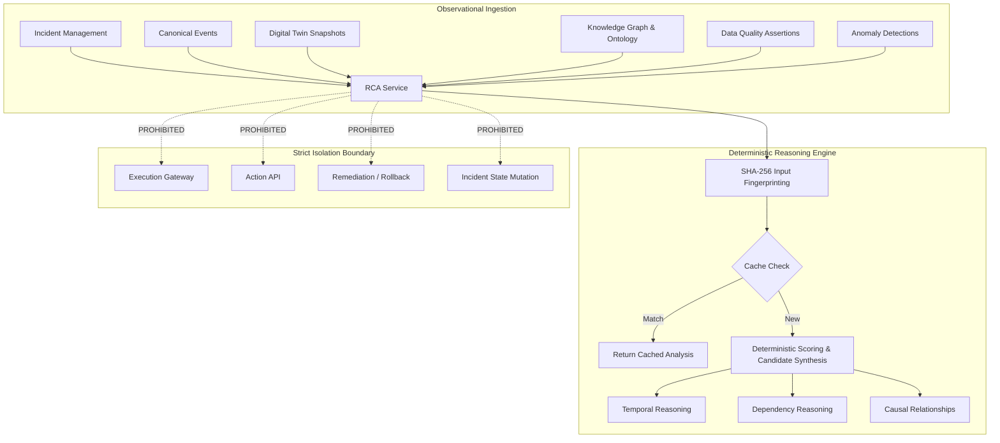

# SageCommand V3 — Root-Cause Analysis Foundation (Prompt 19)

## 1. Overview & Architectural Philosophy
The Root-Cause Analysis (RCA) Foundation introduces deterministic analytical reasoning for industrial operational incidents. In compliance with the SageCommand V3 architecture, RCA functions strictly as an **observational and analytical subsystem**. It possesses **zero execution authority** over physical machinery, actuators, programmable logic controllers (PLCs), or automated remediation workflows.

RCA provides operators, engineers, and plant managers with structured, reproducible candidate hypotheses explaining why an incident occurred, backed by multi-dimensional evidence traces.

---

## 2. Canonical Contracts & Schema
The RCA domain contracts are defined in `backend/data/schemas/rca_contract.py`:

* **`RcaAnalysis`**: Root document for an analysis execution.
  * Fields: `analysis_id`, `incident_id`, `tenant_id`, `workspace_id`, `plant_id`, `schema_version` ("1.0"), `analysis_version` (1), `status` (`RcaAnalysisStatus`), `started_at`, `completed_at`, `method_version` ("deterministic_v1"), `input_fingerprint`, `causes`, `relationships`.
* **`CauseCandidate`**: Ranked hypothesis explaining a potential root or contributing cause.
  * Fields: `cause_id`, `analysis_id`, `cause_type` (`CauseType`), `label`, `description`, `status` ("CANDIDATE"), `score` (0.0 - 100.0), `confidence` (`ConfidenceLevel`), `uncertainty` (string description of variance/bounds), `evidence_refs`, `entity_refs`, `temporal_support`, `dependency_support`, `data_quality_state`, `provenance`.
* **`CausalRelationship`**: Directional link between two cause candidates.
  * Fields: `relationship_id`, `analysis_id`, `source_cause_id`, `target_cause_id`, `relationship_type` (`CausalRelationshipType`), `description`.
* **`TemporalReasoning`**: Quantitative temporal proximity trace.
  * Fields: `time_difference_ms`, `window_used_ms`, `temporal_relation` ("PRECEDES", etc.), `source_timestamp`, `target_timestamp`.
* **`DependencyReasoning`**: Structural topology path trace.
  * Fields: `graph_depth`, `relationship_type`, `source_entity`, `target_entity`, `path`.
* **`RcaEvidence`**: Linkage between a candidate cause and an ingested source.
  * Fields: `evidence_id`, `cause_id`, `source_type` (`EvidenceSourceType`), `source_id`, `relationship`, `recorded_timestamp`, `provenance`, `relevance_metadata`.

### Enums
* `RcaAnalysisStatus`: `PENDING`, `RUNNING`, `COMPLETED`, `INSUFFICIENT_DATA`, `FAILED`, `SUPERSEDED`
* `CauseType`: `EQUIPMENT`, `SENSOR`, `PROCESS`, `MATERIAL`, `OPERATOR`, `SOFTWARE`, `INFRASTRUCTURE`, `ENVIRONMENT`, `UPSTREAM_DEPENDENCY`, `UNKNOWN`
* `CausalRelationshipType`: `PRECEDES`, `DEPENDS_ON`, `CORRELATES_WITH`, `CONTRIBUTES_TO`, `ASSOCIATED_WITH`, `CONTRADICTS`, `SUPPORTS`
* `ConfidenceLevel`: `HIGH`, `MEDIUM`, `LOW`, `UNKNOWN`, `INSUFFICIENT_DATA`
* `DataQualityState`: `VALID`, `INCOMPLETE`, `STALE`, `INVALID`, `UNKNOWN`
* `EvidenceSourceType`: `INCIDENT`, `EVENT`, `ANOMALY`, `TWIN_STATE`, `KNOWLEDGE_GRAPH`, `ONTOLOGY`, `DATA_QUALITY`, `OPERATOR_OBSERVATION`

---

## 3. Evidence Model & Multi-Domain Integration
RCA integrates across all foundational V3 operational contexts:
* **Canonical Events (`EvidenceSourceType.EVENT`)**: Events associated with the incident provide temporal sequence markers.
* **Anomaly Detection (`EvidenceSourceType.ANOMALY`)**: Statistical and ML anomaly flags inform process and equipment deviation hypotheses.
* **Digital Twin (`EvidenceSourceType.TWIN_STATE`)**: State snapshots capture simulated physical metrics and setpoint discrepancies at time of failure.
* **Knowledge Graph & Ontology (`EvidenceSourceType.KNOWLEDGE_GRAPH` / `ONTOLOGY`)**: Upstream/downstream asset topologies enable multi-hop dependency path resolution (`DependencyReasoning`).
* **Data Quality (`EvidenceSourceType.DATA_QUALITY`)**: Stale, missing, or out-of-spec sensor readings are surfaced to discount unreliable telemetry.

---

## 4. Deterministic Reasoning & Fingerprinting
To prevent non-deterministic hallucinations, RCA implements strict reproducibility:
1. **Input Normalization**: Evidence identifiers are sorted lexicographically.
2. **SHA-256 Fingerprint**:
   $$\text{Fingerprint} = \text{SHA256}(\text{incident\_id} \parallel \text{sorted\_evidence} \parallel \text{kg\_version} \parallel \text{twin\_snapshot\_id} \parallel \text{method\_version})$$
3. **Duplicate Prevention (Cache Behavior)**: If an analysis with the identical fingerprint exists within the tenant scope, the existing analysis is returned immediately without duplicate compute or database insertion.
4. **Deterministic Scoring**: Candidate causes are scored mathematically (bounded $[10.0, 95.0]$) based on temporal proximity, dependency graph depth, and data quality state.
5. **Confidence & Uncertainty**: Confidence levels (`HIGH`, `MEDIUM`, `LOW`, `INSUFFICIENT_DATA`) and explicit uncertainty ranges (e.g. $\pm 6.5\%$) are explicitly computed and attached to each candidate.

---

## 5. Persistence Layer
* **Storage**: Embedded SQLite with WAL mode (`PRAGMA journal_mode = WAL`) and foreign keys enabled (`PRAGMA foreign_keys = ON`).
* **Tables**:
  * `rca_analyses`: Stores canonical analysis records, status, and input fingerprints.
  * `rca_causes`: Stores cause candidates, scores, confidence, JSON-serialized entity refs, and temporal/dependency sub-records.
  * `rca_evidence`: Foreign-keyed to `rca_causes` with cascading deletes. Stores source types and JSON metadata.
  * `rca_relationships`: Foreign-keyed to `rca_analyses` and `rca_causes`. Stores causal graphs between candidates.
* **Concurrency Safety**: Synchronized using recursive threading locks (`threading.RLock`) to ensure thread-safe SQLite operations under high concurrency.

---

## 6. Resource Bounds & Configuration Limits
To prevent denial of service and unbounded memory growth:
* `SAGE_RCA_MAX_CANDIDATES = 50`: Maximum number of cause candidates returned per analysis.
* `SAGE_RCA_MAX_EVIDENCE = 1000`: Maximum number of input evidence IDs processed.
* `SAGE_RCA_MAX_GRAPH_DEPTH = 5`: Maximum hop distance for dependency path reasoning.
* `SAGE_RCA_DB_PATH = "sage_rca.sqlite"`: Configurable database path via environment variables.

---

## 7. Security, Authorization & Multi-Tenancy
* **Multi-Tenant Isolation**: Every analysis query and insert enforces `tenant_id` filtering. Tenants cannot view, list, or trigger analyses on other tenants' incidents.
* **Workspace & Plant Isolation**: `workspace_id` and `plant_id` attributes are captured and preserved for scoped visibility.
* **RBAC / ABAC Permissions**:
  * `rca.read`: Granted to `VIEWER`, `OPERATOR`, `SAFETY_MANAGER`, `PLANT_MANAGER`, `SYSTEM_ADMIN`.
  * `rca.analyze`: Granted to `OPERATOR`, `SAFETY_MANAGER`, `PLANT_MANAGER`.
  * `rca.admin`: Granted to `PLANT_MANAGER`, `SYSTEM_ADMIN`.

---

## 8. REST API Endpoints
All endpoints are exposed under `/api/v3/rca`:
* `POST /api/v3/rca/analyze/{incident_id}`: Trigger deterministic analysis for an incident. Requires `rca.analyze`.
* `GET /api/v3/rca/analyses/{incident_id}`: List all analyses for an incident. Requires `rca.read`.
* `GET /api/v3/rca/analysis/{analysis_id}`: Retrieve a specific analysis with full causes and relationships. Requires `rca.read`.

---

## 9. Frontend Command Center Integration
* **`RCAModal.tsx`**: Controlled UI dialog allowing operators to:
  * Trigger deterministic analysis by specifying target incident ID and evidence references.
  * Inspect ranked cause hypotheses with visual score bars, confidence badges, and data quality states.
  * View temporal window traces and dependency path connections.
  * Notice explicit visual banner declaring the execution isolation boundary.
* **`OmniHeader.tsx`**: Header action button with purple accent and search icon connecting directly to `RCAModal`.

---

## 10. Strict Execution Boundary Verification
RCA is purely observational. The following boundaries are verified statically and dynamically:
* ❌ No import or invocation of `ExecutionGateway`.
* ❌ No invocation of `action_service` or `/api/v3/actions`.
* ❌ No physical actuation, machine setpoint modification, or PLC write commands.
* ❌ No autonomous remediation or transaction rollback triggers.
* ❌ No mutation of `IncidentLifecycle` (OPEN, ACKNOWLEDGED, INVESTIGATING, MITIGATED, RESOLVED, CLOSED).
* ❌ No implementation of Prompt 20 Blast-Radius Intelligence or predictive maintenance.
