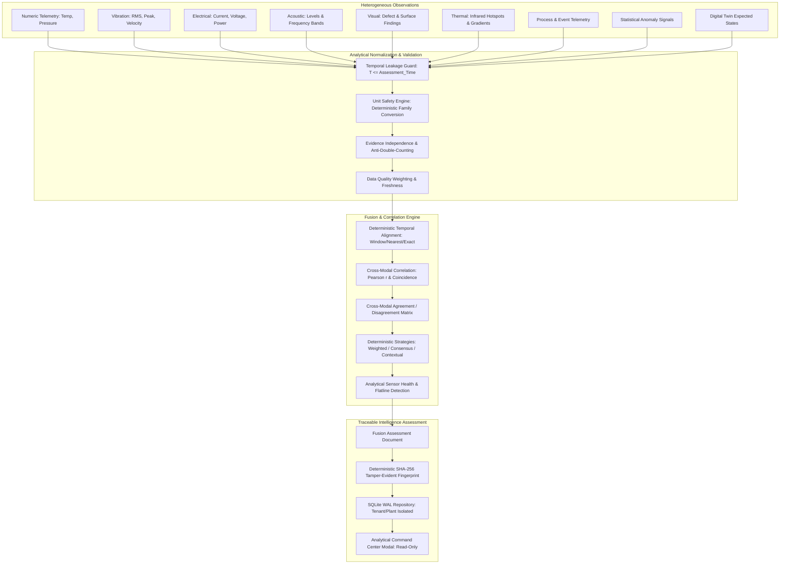

# SageCommand V3 — Multimodal Sensor Fusion Intelligence Foundation (Prompt 27)

## 1. Executive Purpose & System Boundaries

The **Multimodal Sensor Fusion Intelligence Foundation** provides deterministic, explainable, and tenant-isolated analytical fusion of heterogeneous industrial telemetry streams. In complex industrial operations, isolated sensor readings frequently produce false alarms or miss compounding degradations. By correlating numeric telemetry, high-frequency vibration, thermal imaging, acoustic signatures, visual inspection findings, electrical signals, process states, operational events, statistical anomalies, and Digital Twin virtual state, SageCommand V3 synthesizes a unified analytical assessment.

> **CRITICAL EXECUTION BOUNDARY NOTICE**
> 
> **Multimodal Sensor Fusion Intelligence is analytical only. It has no authority to control sensors, actuators, PLCs, physical equipment, maintenance execution, procurement, inventory, or other physical systems.**
> 
> The subsystem strictly enforces execution isolation:
> - NO `ExecutionGateway` imports or invocations.
> - NO Action API creation, approval, or execution.
> - NO PLC or industrial controller writes.
> - NO automatic equipment shutdown or setpoint manipulation.
> - NO automatic work-order generation or maintenance task closing.
> - NO mutation to upstream anomalies, incidents, RCA records, digital twin states, sustainability, or financial records.

---

## 2. Architectural Overview



---

## 3. Controlled Modalities & Measurement Taxonomy

Every observation entering the fusion engine must declare an explicit, strongly typed `Modality` and `MeasurementType`. Free-form text inference of physical modalities is prohibited.

### 3.1 Controlled Modality Enum
* `NUMERIC_TELEMETRY`: General numeric industrial telemetry (flow, speed, levels).
* `VIBRATION`: Dynamic mechanical acceleration, velocity, and displacement.
* `TEMPERATURE`: Contact thermometry (RTD, thermocouples).
* `PRESSURE`: Hydraulic, pneumatic, and process pressure.
* `ELECTRICAL`: Current, voltage, active/reactive power, power factor.
* `ACOUSTIC`: High-frequency sound levels, acoustic emissions, decibel ratings.
* `VISUAL`: Machine vision classification, optical inspection, surface defects.
* `THERMAL`: Infrared thermography, thermal gradients, localized hotspots.
* `PROCESS`: Operating throughput, production rates, cycle counts.
* `EVENT`: Discrete industrial state changes, alarms, trip flags.
* `ANOMALY`: Statistical outlier scores from Prompt 15 Anomaly Engine.
* `DIGITAL_TWIN`: Expected virtual state context from Prompt 13 Digital Twin.

### 3.2 Measurement Types
Physical measurements are categorized strictly:
`TEMPERATURE`, `PRESSURE`, `VIBRATION_RMS`, `VIBRATION_PEAK`, `VIBRATION_ACCELERATION`, `VIBRATION_VELOCITY`, `ACOUSTIC_LEVEL`, `ACOUSTIC_FREQUENCY`, `CURRENT`, `VOLTAGE`, `POWER`, `FREQUENCY`, `POWER_FACTOR`, `FLOW`, `SPEED`, `TORQUE`, `HUMIDITY`, `PROCESS_RATE`, `ENERGY`, `QUALITY_MEASUREMENT`, `VISUAL_DEFECT`, `THERMAL_HOTSPOT`, `THERMAL_GRADIENT`, `GENERIC_NUMERIC`.

---

## 4. Unit Safety & Deterministic Conversions

Physical measurements are only comparable when dimensions match. Combining incompatible units (such as adding temperature to pressure) is strictly rejected.

### Supported Deterministic Conversions:
* **Temperature** (Base: `CELSIUS`):
  $$C = (F - 32) \times \frac{5}{9}, \quad F = C \times \frac{9}{5} + 32, \quad K = C + 273.15$$
* **Pressure** (Base: `BAR`):
  $$1 \text{ bar} = 14.503774 \text{ psi} = 100\,\text{kPa} = 100{,}000\,\text{Pa} = 0.1\,\text{MPa}$$
* **Current** (Base: `AMPERE`):
  $$1 \text{ A} = 1{,}000 \text{ mA}$$
* **Voltage** (Base: `VOLT`):
  $$1 \text{ kV} = 1{,}000 \text{ V} = 1{,}000{,}000 \text{ mV}$$
* **Power** (Base: `WATT`):
  $$1 \text{ kW} = 1{,}000 \text{ W} = 0.001 \text{ MW}$$
* **Acceleration** (Base: `M/S^2`):
  $$1 \text{ g} = 9.80665 \text{ m/s}^2$$

---

## 5. Provenance & Anti-Double-Counting Invariants

### 5.1 Provenance Preservation
The system distinguishes:
* `OBSERVED`: Raw data recorded from calibrated physical instrumentation.
* `DERIVED`: Deterministic mathematical calculations from observed signals.
* `SIMULATED`: Synthetic states generated by Digital Twin or simulation models.
* `ESTIMATED`: Statistical extrapolations.
* `MIXED`: Fused metric combining heterogeneous sources.
* `UNKNOWN`: Unvalidated origin.

**Cardinal Invariant:** Simulated values are never converted into observed sensor readings.

### 5.2 Evidence Independence & Double-Counting Protection
When evaluating multiple observations, the engine tracks `source_lineage` and `parent_observation_id`. If a physical vibration sensor $S_1$ reports raw acceleration and a software pipeline derives RMS velocity from $S_1$, the system flags the derived velocity as non-independent ($is\_independent = \text{False}$). Non-independent evidence is down-weighted to prevent artificial inflation of analytical confidence.

---

## 6. Temporal Integrity & Future Leakage Protection

For an analytical assessment conducted at timestamp $T$:
1. **Future Leakage Guard**:
   $$\text{observation.observed\_at} \le T$$
   Any observation, anomaly, event, or Digital Twin snapshot dated $> T$ is excluded.
2. **Evaluation Window**:
   $$\text{observation.observed\_at} \ge T - \text{window\_duration}$$
3. **Temporal Alignment**:
   * `EXACT`: Identical timestamps within 1 ms.
   * `NEAREST`: Closest observation within configured temporal tolerance.
   * `WINDOW`: Bucket observations across the entire evaluation interval.
   * `RESAMPLED`: Resample time series into discrete intervals.

---

## 7. Cross-Modal Correlation & Agreement Analysis

### 7.1 Cross-Modal Correlation
Where two numerical streams have $\ge 3$ aligned samples within the evaluation window, the engine computes the Pearson correlation coefficient:
$$r = \frac{\sum (x_i - \bar{x})(y_i - \bar{y})}{\sqrt{\sum (x_i - \bar{x})^2 \sum (y_i - \bar{y})^2}}$$
*Correlation does NOT imply causation.* The assessment explicitly documents sample count and statistical limits.

### 7.2 Agreement / Disagreement Logic
Observations are normalized to a standard severity/stress score $\in [0.0, 1.0]$:
* **`AGREEMENT`**: Multiple independent modalities (e.g. Vibration RMS $> 6\,\text{mm/s}$ and Temperature $> 80^\circ\text{C}$ and Acoustic $> 85\,\text{dB}$) concurrently show elevated stress.
* **`DISAGREEMENT`**: Modalities materially conflict (e.g. Vibration indicates critical mechanical shock, but current, temperature, and visual inspection remain normal). Disagreement drastically reduces confidence and elevates uncertainty.
* **`PARTIAL_AGREEMENT`**: Some modalities corroborate while others remain neutral.
* **`INSUFFICIENT_EVIDENCE`**: Fewer than 2 independent valid modalities exist.

---

## 8. Electrical Sanity Check

Where Current ($I$), Voltage ($V$), and Active Power ($P$) are simultaneously observed:
$$\text{Apparent Power } S = V \times I, \quad \text{Power Factor } PF = \frac{P}{S}$$
If the apparent power $S > 0$ and $PF < 0.5$ or $PF > 1.2$, the system reports an analytical electrical discrepancy limitation without assuming failure.

---

## 9. Deterministic Confidence & Uncertainty

### Qualitative Confidence:
* **`HIGH`**: $\ge 3$ independent agreeing modalities, high data quality ($\ge 0.8$), fresh observations, verified `OBSERVED` provenance.
* **`MEDIUM`**: 2 independent agreeing modalities or moderate data quality.
* **`LOW`**: Only 1 modality present, material disagreement between modalities, stale observations, or degraded source quality.
* **`UNKNOWN`**: Missing essential telemetry or zero eligible samples.

### Qualitative Uncertainty:
* **`LOW`**: High confidence, strong agreement, zero conflicts.
* **`MEDIUM`**: Minor variance or partial agreement.
* **`HIGH`**: Cross-modal conflict, missing modalities, stale signals, or simulated/unknown provenance.

---

## 10. Analytical Sensor Health Indicators

The engine computes non-actuating reliability indicators for reporting sensors:
* **Stale Signal**: Timestamp gap $> 3600\,\text{s}$.
* **Constant Value / Flatline**: Zero variance across $\ge 3$ consecutive samples.
* **Out of Bounds**: Impossible physical readings (e.g. Negative Kelvin or negative absolute pressure).
* **Degraded Source Quality**: Upstream Data Quality score $< 0.6$.

---

## 11. Deterministic SHA-256 Fingerprinting

Every assessment computes a canonical SHA-256 hash over:
- Tenant, workspace, plant, and target entity IDs;
- Assessment timestamp and window parameters;
- Deterministically sorted normalized observations;
- Canonical weighting rules and methodology string;
- Contextual metadata keys.

Requirements:
```text
same input → same fingerprint
material change → different fingerprint
reordered input → same fingerprint
```
Duplicate requests return the existing persisted assessment without creating redundant database records.

---

## 12. Security, Isolation, & Resource Limits

* **Tenant Isolation**: Mandatory partition key on all database queries and API endpoints.
* **Plant Isolation**: Enforced via user assigned-plant claims.
* **RBAC & ABAC**:
  * `sensor_fusion.read`: View assessments and entity summaries.
  * `sensor_fusion.analyze`: Trigger deterministic multimodal analysis.
  * `sensor_fusion.evaluate`: Evaluate sensor reliability and agreement.
  * `sensor_fusion.admin`: Configure weighting rules and system parameters.
* **Resource Limits**:
  * Max observations per assessment: 1,000.
  * Max evaluation window: 30 days.
  * Max query results: 200.
  * Max correlation samples: 5,000.

---

## 13. API Specification

| Method | Endpoint | Permission | Description |
|---|---|---|---|
| `POST` | `/api/v3/sensor-fusion/analyze` | `sensor_fusion.analyze` | Run deterministic fusion analysis |
| `GET` | `/api/v3/sensor-fusion/assessment/{id}` | `sensor_fusion.read` | Retrieve assessment by ID |
| `GET` | `/api/v3/sensor-fusion/assessments` | `sensor_fusion.read` | List historical assessments (scoped) |
| `GET` | `/api/v3/sensor-fusion/entities/{id}/summary` | `sensor_fusion.read` | Aggregate sensor reliability summary |

---

## 14. Known Limitations

1. **Correlation vs Causation**: Cross-modal statistical correlation does not establish mechanical or electrical causality.
2. **Single Modality Fallback**: When only one sensor modality is reporting, cross-modal corroboration is impossible and confidence is automatically capped at `LOW`.
3. **Sampling Rate Mismatches**: Fast acoustic/vibration signals ($>1\,\text{kHz}$) combined with slow SCADA temperatures ($0.1\,\text{Hz}$) require aggregation windows rather than sample-by-sample alignment.
4. **Non-Actuating Design**: Sensor fusion cannot take remedial action. Any maintenance, control change, or actuator command requires explicit external operator authorization through approved governance workflows.
